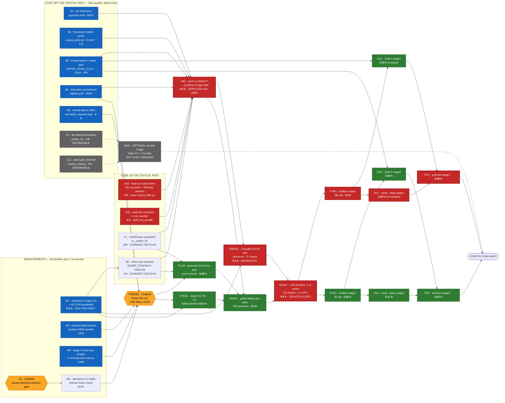

# Build dependency graph — what parallelizes, what cannot, and why

**Written 2026-08-07.** Companion to `docs/IMPLEMENTATION-PLAN.md`, which says *what* to build and how
long each step takes. This document says **what may run at the same time**, and it is written to be
handed to an orchestrating agent.

**The answer up front:** the critical path is **13.3 hours** with correct parallelization, against
**~36 h** if the work is run as written today and **17.3 h** if it is parallelized naively. The
irreducible floor is **8.41 h** of pure job time — so only ~4.9 h of code and setup can ever sit ahead
of the jobs. **Everything beyond that is either waiting on a human or wasted.**

---

## 1. The three currencies, which are not interchangeable

Most parallelization mistakes here come from mixing these up.

| currency | unit | what buys more of it | what caps it |
|---|---|---|---|
| **agent-hours** | code items | more agents in more worktrees | **file contention** (§3), not logic |
| **wall-hours** | AWS jobs | more array children, more workers | **128 vCPU** compute environment |
| **calendar** | human gates | nothing — you wait | approval latency, license acceptance |

A code item and a job of the same nominal duration are **not** substitutable: 8 agent-hours of code can
run alongside 8 wall-hours of jobs, but two code items touching the same function cannot run alongside
each other at all.

---

## 2. The graph

**Red = critical path. Blue = parallel. Grey = deferrable to a second image. Amber = waits on a human.**

---

## 3. ⚠️ The real constraint is file contention, not logic

**This is the part an orchestrator gets wrong.** Eleven code items look independent on a task list.
They are not — five of them edit `corpus_build.py`, and within that file they cluster into **two
functions**:

| function | items that edit it | verdict |
|---|---|---|
| `_reader_for` | **C1**, C3, C11 | one owner, or three-way conflict |
| `run_bundle` | **A2b**, C7 | one owner |
| `corpus.py` | **B6**, C3 | different constants, but same file — merge risk |

| file | items | contention |
|---|---|---|
| `corpus_build.py` | C1, C3, C4→A2b, C7, C11 | **5 — hottest file in the plan** |
| `corpus.py` | C3, B6 | 2 |
| everything else | 1 each | none |

**Rules for the orchestrator:**

1. **One agent owns one function, never one file.** `_reader_for` and `run_bundle` can be two agents in
   two worktrees, because they do not overlap textually — but both must be told the other exists.
2. **Distinct-file items are genuinely free.** B1, B2, B3, B4, B5 can be five simultaneous agents with
   zero coordination.
3. **Worktrees are mandatory** for anything touching `corpus_build.py`, per this repo's own convention:
   `../Capstone_LLM-worktrees/edullm-data/<agent-id>--<task-slug>` on `agent/<agent-id>/<task-slug>`.
4. **Merge order is `_reader_for` → `run_bundle` → everything else**, because the first two are on the
   critical path and a late merge conflict there costs image-build time.

---

## 4. The four hard serialization points

Nothing parallelizes past these. They are why 13.3 h is the floor and not 8.41 h.

### S1 — the image build gates every AWS job
Container images build **only from `edullm/**` branches** (`.github/workflows/edullm-platform-build.yml:9-10`).
A merge to `main` builds **nothing, silently**, and a submission naming that commit is refused for having
no image. So **all code that the jobs need must land in one push**, and every job waits on it.

**Consequence:** batching code into one image is *better* than shipping two. Measured against the graph,
a two-image scheme (pre-pass early, build later) came out **0.1 h worse** — the second build's 0.5 h
lands directly on the critical path.

### S2 — `FREEZE` is a human decision with an unbounded duration
Adding a source after the plan is generated renames **98% of shards** and voids **882B tokens**
(`IMPLEMENTATION-PLAN.md` §0). So the mix must be final first. **Its duration is a decision, not a
computation** — it is the one node whose length no amount of parallelism touches.

### S3 — `BUILD` is capped at 128 vCPU
6.6 h is the tokenize floor at the cap. Slicing bundles does not lower it; it only prevents a long tail
(the 159B-token `stackv2-edu` bundle is a 4.37 h single child unless file-sharded).

### S4 — `VD1` cannot start until `PUB1` finishes
`verify --deep` re-hashes published objects, so it is strictly after publish. At 8 workers it is 1.49 h,
and it sits on the critical path with no way around it. **At `--hash-workers 1` it is 11.7 h and exceeds
its timeout**, which is the single highest-value flag in the plan.

---

## 5. The critical path, and everything with slack

**Critical path — 13.31 h:**

| from → to | node | why it cannot move |
|---|---|---|
| 0.00 → 4.00 | **A2a** hash pre-pass driver | nothing to parallelize with; `PASS1` needs it |
| 4.00 → 4.50 | **IMG** image build | S1 |
| 4.50 → 4.90 | **SMOKE** live-HF smoke test | mandatory; the path has never run |
| 4.90 → 11.50 | **BUILD** ~100 bundles | S3, the 128 vCPU floor |
| 11.50 → 11.80 | **PUB1** publish stage 1 | after build |
| 11.80 → 13.29 | **VD1** verify --deep stage 1 | S4 |
| 13.29 → 13.31 | **PR1** promote stage 1 | after both gates |

**Everything else has slack and should be started at t=0 regardless:**

| node | duration | slack | note |
|---|---|---|---|
| M1 bandwidth | 0.2 h | large | **but run it first anyway** — it calibrates every other estimate |
| M2 / M4 samples | 1.0 h each | ~3 h | gate `FREEZE`, not the build |
| M3 footer count | 0.1 h | ~3.9 h | blocked on a **human** licence acceptance (G1) |
| A2b keep-list consumer | 4 h | 0 h — **joint-critical** | must finish before IMG, same as A2a |
| B3 thread Gate A | 4 h | 7.5 h | only `GA1`/`GA2` need it |
| B5 rebuild decon index | 4 h | ~0.9 h — **nearly critical** | gates `FREEZE`; start it early |
| B1 / B2 / B4 | ≤1 h | large | trivially parallel |
| **C3 / C11** | 5 h combined | **∞ — deferrable** | pure optimization + instrumentation. **Do not put them in the first image** |

**Stage 2 is entirely parallel to stage 1's tail.** `PUB2`/`GA2`/`VD2`/`PR2` total 0.25 h and finish
while stage 1 is still verifying, so stage 2 contributes **nothing** to the critical path.

---

## 6. What the orchestrator should actually launch

### Wave 0 — immediately, 8 concurrent workstreams
| stream | work | kind |
|---|---|---|
| 1 | **M1 bandwidth measurement** | job — **do this first, it recalibrates the rest** |
| 2 | M2 Dolma3 sample + M4 doc lengths | job |
| 3 | **Ask the owner to accept the Nemotron licence gate** | human |
| 4 | **A2a** hash pre-pass driver (owns `corpus_filter.py`) | agent, worktree |
| 5 | **A2b** keep-list consumer (owns `run_bundle`) | agent, worktree |
| 6 | **C1 + B6** (owns `_reader_for` + `SHARD_TOKENS`) | agent, worktree |
| 7 | **B5** rebuild the decon index (external repo) | agent |
| 8 | B1 + B2 + B3 + B4 (four distinct files) | agent(s) |

**Do not launch C3 or C11 in wave 0.** They are deferrable, they contend with C1 on `_reader_for`, and
including them adds ~5 h of agent time to the critical path for zero wall-clock benefit.

### Wave 1 — merge, then one push
Merge in order `_reader_for` → `run_bundle` → the rest. Push to an `edullm/**` branch. **One image.**

### Wave 2 — the gate
`FREEZE` the mix, generate the plan, stage the sources. `STAGE` can overlap `SMOKE`.

### Wave 3 — jobs
`PASS1` → `BUILD` (16 children × 8 vCPU) → then stage 1 and stage 2 publish/validate **in parallel**.

**Every AWS job needs a separate human release. Nothing auto-publishes.**

---

## 7. Where parallelism is wasted — spend nothing here

| tempting | why it does not help |
|---|---|
| More than 16 build children | 128 vCPU ÷ 8 = 16. More children just queue |
| Splitting `BUILD` further | 6.6 h is the CPU floor at the cap, not a scheduling artifact |
| Two container images | measured **0.1 h worse** — the second build lands on the critical path |
| Parallelizing `STAGE` harder | it has ~4 h of slack; it is never the constraint |
| Doing C3 / C11 now | deferrable, and they contend on the hottest function in the repo |
| More agents on `corpus_build.py` | file contention. A third agent there produces conflicts, not speed |
| Rushing before M1 lands | every read estimate is calibrated on an **unmeasured** bandwidth |

---

## 8. The orchestrator brief — copy this

Hand this to the agent that runs wave 0. It encodes the constraints above as rules rather than prose.

> **You are orchestrating the Phase-0 build for `pretrain/final-dataset`. Launch these 8 streams
> concurrently and hold them to these rules.**
>
> **Stream 1 (job, FIRST):** measure in-region S3 read bandwidth and HF CDN throughput. Report both.
> **Every read estimate in `IMPLEMENTATION-PLAN.md` §8A is calibrated on an unmeasured ~85 MB/s
> borrowed from an S3 measurement; one plausible reconciliation says the CDN is ~8.4 MB/s.** If it is,
> tell me before anything else proceeds — it changes the staging decision.
>
> **Stream 2 (job):** Dolma3 adult-content prevalence at **random offsets** (a prior attempt could not
> separate signal from HuggingFace preview ordering), plus mean document length for the 5 unmeasured
> stage-2 sources.
>
> **Stream 3 (human):** ask the owner to accept the Nemotron-CC-Math licence gate. Its text and id
> columns are **UNVERIFIED** and it is the only stage-1 source whose text column we cannot name.
>
> **Streams 4–6 (code, one worktree each, one function each — NOT one file each):**
> - **4:** the flat-`np.uint64` hash pre-pass. Owns `corpus_filter.py`.
> - **5:** the keep-list consumer. Owns `run_bundle` in `corpus_build.py`.
> - **6:** the FinePhrase id partition + the shard-size constant. Owns `_reader_for` in
>   `corpus_build.py` and `SHARD_TOKENS` in `corpus.py`.
>
> **⚠️ Streams 5 and 6 both edit `corpus_build.py` in different functions.** Tell each about the other.
> Worktree convention: `../Capstone_LLM-worktrees/edullm-data/<agent-id>--<task-slug>` on
> `agent/<agent-id>/<task-slug>`. Merge order is **stream 6 → stream 5 → the rest.**
>
> **Stream 7 (code):** rebuild the decontamination index from **raw** benchmark fields (question alone,
> question + each choice, question + correct answer) **in addition to** the rendered form. External
> repo, no conflict. **It gates the mix freeze — do not let it start late.**
>
> **Stream 8 (code, four distinct files, no coordination needed):** pin `tokenizers` in
> `pyproject.toml`; fix the boundary-marker prefix guard in `corpus_pack.py` **and** the test that
> asserts the table length is 1; thread the Gate A profile checks in `pretrain_tokens_v1.py` **and**
> raise `max_pool_connections` in `s3.py` (threading against a 10-connection pool self-throttles);
> drop `data_provenance_initiative` from the registry.
>
> **Do NOT start:** val-bundle file-sharding or the `bytes_fetched` wiring. Both are deferrable, both
> contend with stream 6 on `_reader_for`, and including them adds ~5 agent-hours to the critical path
> for **zero** wall-clock gain.
>
> **When all streams land:** merge in the stated order, push **once** to an `edullm/**` branch — images
> build only from that namespace, a merge to `main` builds nothing silently — and stop. **Do not submit
> any AWS job.** Report what landed and wait for a release decision.
>
> **Standing rules:** write findings to disk incrementally (a prior wave lost 4 agents to an API budget
> cap and only on-disk partials survived); grade every number MEASURED / DERIVED / CARD / UNVERIFIED;
> *"nobody has measured this"* is a finding, not a failure; and if you find that one of my numbers is
> wrong, say so — two of them already were.

---

## 9. Honest limits of this graph

- **Durations for code items are estimates, not measurements.** The *ordering* is well-evidenced; the
  absolute agent-hours are my judgement. An earlier session's per-bundle ETAs were all retracted by
  their own author with the verdict *"every per-bundle ETA I gave was wrong, in both directions."*
- **`BUILD`'s 6.6 h assumes linear vCPU scaling**, measured only at 32 vCPU. Never tested at 128.
- **Every read duration assumes ~85 MB/s borrowed from an S3 measurement.** If the HF CDN is really
  ~8.4 MB/s, `STAGE` moves from 0.5 h to days and becomes critical. **M1 exists to settle exactly
  this — which is why it is wave 0, stream 1.**
- **The 13-gram decontamination scan's CPU cost has never been measured** (~193 billion Python-level
  `blake2b` calls). If it is comparable to tokenization, `BUILD` is longer than 6.6 h.
- **`FREEZE` and G1 have no duration here because they are human.** In practice they may dominate the
  calendar, and no amount of parallelism touches them.
