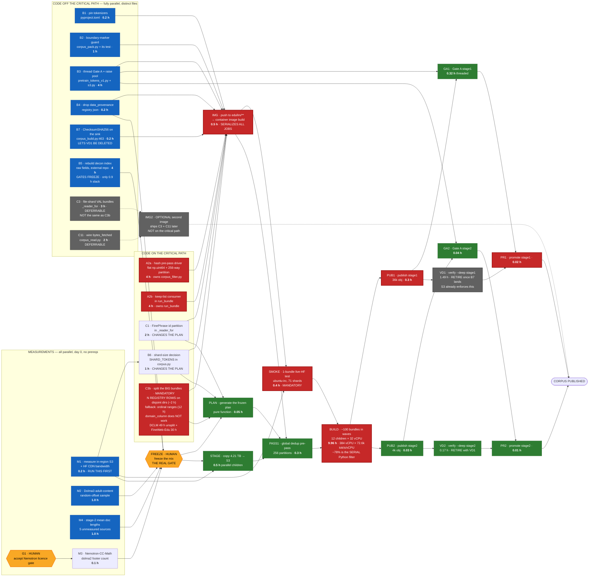

# Build dependency graph — what parallelizes, what cannot, and why

**Written 2026-08-07.** Companion to `docs/IMPLEMENTATION-PLAN.md`, which says *what* to build and how
long each step takes. This document says **what may run at the same time**, and it is written to be
handed to an orchestrating agent.

**The answer up front:** the critical path is **15.5 h** if task #28 splits DCLM via registry rows, **23.5 h**
via the ordinal-range route, and **54.5 h** if it is not split at all — against **~74 h** run as written today.
**11.0 h of that is jobs on the path.**

**⚠️ Two 2026-08-07 findings reshaped this graph. Both are MEASURED; neither was known when it was written.**

1. **The CPU cap is 384 vCPU, not 128** (§8B.5 — quota 1,152, one queue 1:1, all 5 AZs offer the type), **and
   the per-vCPU rate is 72,615 tok/s end-to-end, not the 0.328 M of `encode_batch` in isolation** (§8A.3,
   MEASURED from the real run's CloudWatch logs — tokenize is only ~22% of build cost; ~78% is the
   single-threaded Python filter). **These nearly cancel: the build floor is 9.96 h**, against 6.61 h
   originally and a briefly-believed 2.21 h.
2. **`verify --deep` is retirable** (§8.3a) — a verified PUT is rejected server-side on digest mismatch, so
   the re-hash re-establishes a guarantee the write path already enforces. Needs `B7` first (~5 lines).

**C3b is now MANDATORY under either route** — an un-split DCLM is 49 h as one child:

| scenario | `BUILD` | code ahead of it | **critical path** |
|---|---|---|---|
| the graph as first written — C3b deferred, `BUILD` assumed 6.6 h | 6.6 h | A2a 4 h | 13.31 h ❌ **never achievable** |
| **do nothing** — DCLM stays one un-splittable child | **49.0 h** | A2a 4 h | **54.54 h** |
| **C3b via ordinal ranges**, ~12 h of code | 9.96 h | **C3b 12 h** | **23.50 h** |
| **C3b via N REGISTRY ROWS on disjoint subdirectories**, ~2 h | 9.96 h | absorbed by A2a | **15.50 h** ✅ |

**⚠️ An earlier version of this table said the 12 h route "buys only 0.64 h." That is WITHDRAWN** — it was
computed from the isolated-encode rate. At the measured rate the ordinal route buys **31 h** and the registry
route **39 h**. Splitting is no longer optional, and an agent blocked on the registry route should proceed
with ordinal ranges rather than reconsidering doing nothing.

**❌ And the `domain_column` route does NOT work** — `_domain_of` receives only the parquet row, so a
file-index-derived domain is not expressible without threading the file entry through `corpus_read`. See
`artifacts/impl-plan/task-28-briefing.md` §2.2. **The instruction to stream 4 changes accordingly — §6.**

**The full history of this number, because it moved three times and each move had a cause:**

| version | `BUILD` | path | what changed |
|---|---|---|---|
| as first written | 6.6 h | 13.31 h ❌ | assumed a floor its own deferred item made unreachable |
| after blocker 0 | 6.6 h | 21.31 h | C3b added at 12 h, on the path |
| after `B7` / retiring `VD1` | 6.6 h | 20.14 h | −1.17 h (not −1.49: `GA1` was parallel and gets exposed) |
| after the 384 vCPU measurement | 2.21 h | 7.75 h | the floor appeared to fall 3× |
| **after the RATE correction (4.52×)** | **9.96 h** | **15.50 h** ✅ / 23.50 h | the two corrections nearly cancel; splitting became mandatory |

**Read the last two rows together.** The 2.21 h row was believed for about an hour and produced a conclusion
("12 h of code buys 0.64 h") that the rate correction reversed. **The lesson: a capacity fact and a
throughput fact multiply, so correcting one without the other can move a decision twice.**

**The job-time floor is 11.0 h** — `SMOKE` 0.4 + `BUILD` 9.96 + `PUB1` 0.3 + `GA1` 0.32 + `PR1` 0.02, the
jobs actually on the path once `VD1` is retired. (Earlier versions said 8.41, 8.81, 7.64, then 3.25 h — each
summing a different set at a different cap or rate; §5 derives it explicitly so it cannot drift again.)

**Jobs and code are now comparable — 11.0 h of jobs against a 15.5 h path.** The C3b route choice is still
the largest single lever (39 h), but the build itself is no longer negligible, which it briefly appeared to
be.

---

## 1. The three currencies, which are not interchangeable

Most parallelization mistakes here come from mixing these up.

| currency | unit | what buys more of it | what caps it |
|---|---|---|---|
| **agent-hours** | code items | more agents in more worktrees | **file contention** (§3), not logic |
| **wall-hours** | AWS jobs | more array children, more workers | **384 vCPU** — but capped at **~6.2×** by the single-threaded filter (§9) |
| **calendar** | human gates | nothing — you wait | approval latency, license acceptance |

A code item and a job of the same nominal duration are **not** substitutable: 8 agent-hours of code can
run alongside 8 wall-hours of jobs, but two code items touching the same function cannot run alongside
each other at all.

---

## 2. The graph

**Red = critical path. Blue = parallel. Grey = deferrable to a second image. Amber = waits on a human.**

---

## 3. ⚠️ The real constraint is file contention, not logic

**This is the part an orchestrator gets wrong.** Eleven code items look independent on a task list.
They are not — five of them edit `corpus_build.py`, and within that file they cluster into **two
functions**:

| function | items that edit it | verdict |
|---|---|---|
| `_reader_for` | **C1**, C3, C11 | one owner, or three-way conflict |
| `run_bundle` | **A2b**, C7 | one owner |
| **`allocate_ordinals` / `plan_document`** | **C3b**, B6 | **one owner — and it is the critical-path item** |
| `corpus.py` | **B6**, **C3b**, C3 | 3 — different constants and functions, same file |

| file | items | contention |
|---|---|---|
| `corpus_build.py` | C1, C3, C4→A2b, C7, C11 | **5 — hottest file in the plan** |
| **`corpus.py`** | **B6, C3b, C3** | **3 — and C3b is critical, so a conflict here costs image time** |
| everything else | 1 each | none |

**⚠️ C3b and B6 belong to the same agent.** Both change what `plan_document` emits — B6 changes
`SHARD_TOKENS`, C3b adds per-child ordinal ranges — and both therefore change every `plan_id`. Splitting
them across two agents means two conflicting rewrites of the plan schema on the critical path. Give one
agent `corpus.py`'s plan surface entirely.

**Rules for the orchestrator:**

1. **One agent owns one function, never one file.** `_reader_for` and `run_bundle` can be two agents in
   two worktrees, because they do not overlap textually — but both must be told the other exists.
2. **Distinct-file items are genuinely free.** B1, B2, B3, B4, B5 can be five simultaneous agents with
   zero coordination.
3. **Worktrees are mandatory** for anything touching `corpus_build.py`, per this repo's own convention:
   `../Capstone_LLM-worktrees/edullm-data/<agent-id>--<task-slug>` on `agent/<agent-id>/<task-slug>`.
4. **Merge order is `_reader_for` → `run_bundle` → everything else**, because the first two are on the
   critical path and a late merge conflict there costs image-build time.

---

## 4. The four hard serialization points

Nothing parallelizes past these. They are why the path is 21.31 h and not the 8.81 h of job time inside it.

### S1 — the image build gates every AWS job
Container images build **only from `edullm/**` branches** (`.github/workflows/edullm-platform-build.yml:9-10`).
A merge to `main` builds **nothing, silently**, and a submission naming that commit is refused for having
no image. So **all code that the jobs need must land in one push**, and every job waits on it.

**Consequence:** batching code into one image is *better* than shipping two. Measured against the graph,
a two-image scheme (pre-pass early, build later) came out **0.1 h worse** — the second build's 0.5 h
lands directly on the critical path.

### S2 — `FREEZE` is a human decision with an unbounded duration
Adding a source after the plan is generated renames **98% of shards** and voids **882B tokens**
(`IMPLEMENTATION-PLAN.md` §0). So the mix must be final first. **Its duration is a decision, not a
computation** — it is the one node whose length no amount of parallelism touches.

### S3 — `BUILD` is **9.96 h**: 384 vCPU (measured) × 72,615 tok/s/vCPU (measured)
Two facts, both MEASURED, and they nearly cancel: the cap is **384** not 128 (`maxvCpus: 384`, EC2 quota
1,152, one queue 1:1, `c7i.8xlarge` in all 5 of the CE's AZs), and the rate is **72,615 tok/s/vCPU
end-to-end** not the 0.328 M of `encode_batch` in isolation — because **~78% of build cost is
`dedup_and_decontaminate`, a single-threaded Python generator that holds the GIL.**
`IMPLEMENTATION-PLAN.md` §8A.3 and §8B.5. The cap allows **12 concurrent children** at 32 vCPU.

**⚠️ The floor is only reachable if the big bundles are split.** Per-child duration is *that child's* tokens
÷ *that child's* vCPU, and a Batch child cannot exceed one instance. **DCLM is 410B in one non-fanning-out
bundle — 49.0 h on its 32 vCPU, 4.9× the floor and unchanged by the cap.** **FineWeb-Edu is second at
30.1 h.** Whichever route stream 4 takes must cover both.

**Ways needed depends on child size, so say which you mean:** at 32 vCPU, DCLM needs **5** and FineWeb-Edu
**4** (288 of 384 vCPU together). At 8 vCPU it is **20** and **13**.

**And `--shard/--of` strides *bundles*, so the capability does not exist in the code.** The route that works
is **N registry rows on disjoint subdirectories** (§8A.3) — the `domain_column` alternative an earlier draft
recommended **does not work**, because `_domain_of` never sees the file entry.

⚠️ **More machines cap at ~6.2× regardless**, because the filter is serial: the reservoir's longest single
bundle was 14.4 h against 89.3 container-hours of total work. **Parallelizing the filter is the follow-on to
splitting, and it is what would take 14.4 h → ~3.2 h.**

### S4 — ~~`VD1` cannot start until `PUB1` finishes~~ → **delete `VD1` instead**
`verify --deep` re-hashes published objects, so it is strictly after publish. At 8 workers it is 1.49 h and
it sits on the critical path; at `--hash-workers 1` it is 11.7 h and exceeds its timeout.

**⚠️ But the right move is to retire it, not thread it** (`IMPLEMENTATION-PLAN.md` §8.3a). A verified PUT is
rejected server-side on digest mismatch — proven live 2026-08-01: `BadDigest`, and **no object is created**
— and `CopyObject` recomputes the checksum on the publish hop. So the re-hash re-establishes a guarantee the
write path already enforces.

**Prerequisite: `B7`.** `corpus_build.py:463`'s sink calls a plain `put` and declares no checksum, so today
the re-hash *is* the only thing behind those bytes. **Ship `B7` (~5 lines) first, then delete `VD1`.** Never
the reverse.

**Effect: critical path 16.67 h → 15.50 h.** Note that is **1.17 h, not the 1.49 h `VD1` costs** — `VD1` and
`GA1` run in parallel between `PUB1` and `PR1`, so deleting the longer branch **exposes** the shorter one.
Deleting a parallel branch buys the *difference*, not the branch. Recomputed on the DAG, not subtracted.

**S4 therefore stops being a hard serialization point at all** — the remaining `PUB1 → GA1 → PR1` chain is
0.34 h.

---

## 5. The critical path, and everything with slack

**Critical path — 15.50 h** with the registry-row C3b route and `VD1` retired. The ordinal-range route gives
**23.50 h**; the difference is 12 h of code minus 2 h, sitting in front of `IMG`.

| from → to | node | why it cannot move |
|---|---|---|
| 0.00 → 4.00 | **A2a** hash pre-pass driver | the longest *unavoidable* code item; **C3b's registry route (~2 h) hides inside this 4 h** |
| 4.00 → 4.50 | **IMG** image build | S1 — one push, `edullm/**` only |
| 4.50 → 4.90 | **SMOKE** live-HF smoke test | mandatory; the path has never run |
| 4.90 → 14.86 | **BUILD** ~100 bundles | S3 — 384 vCPU × the measured 72,615 tok/s/vCPU = **9.96 h** |
| 14.86 → 15.16 | **PUB1** publish stage 1 | after build |
| 15.16 → 15.48 | **GA1** Gate A stage 1 | recomputes from bytes in a **different process** — the one gate that is not a tautology (`IMPLEMENTATION-PLAN.md` §8.3b) |
| 15.48 → 15.50 | **PR1** promote stage 1 | after the gate |

**With the ordinal-range route, `C3b`'s 12 h replaces `A2a`'s 4 h at the head** and everything shifts +8 h.
That single substitution is the whole 15.50 h ↔ 23.50 h spread.

**Where the 11.0 h job floor comes from**, stated as a sum so it cannot drift from the headline again:

| node | h | on the path? |
|---|---|---|
| SMOKE | 0.40 | ✅ |
| **BUILD** | **9.96** | ✅ — 384 vCPU at the MEASURED rate (6.60 at the withdrawn 128; 2.21 at the isolated rate) |
| PUB1 | 0.30 | ✅ |
| GA1 | 0.32 | ✅ — **it inherits VD1's slot on the path** |
| PR1 | 0.02 | ✅ |
| **subtotal — the job floor** | **11.00** | |
| STAGE 0.5 · PASS1 0.3 · PLAN 0.05 | 0.85 | ❌ absorbed by the code prefix's slack |
| PUB2/GA2/PR2 | 0.08 | ❌ parallel to stage 1's tail |
| ~~VD1 1.49 · VD2 0.17~~ | ~~1.66~~ | **retired — S4** |
| **all remaining job rows summed** | **11.93** | — |

⚠️ **`GA1` moved onto the critical path by deletion, not by getting slower.** It always ran in parallel with
`VD1` between `PUB1` and `PR1`; removing the 1.49 h branch exposes the 0.32 h one. **That is why the saving
is 1.17 h and not 1.49 h.**

**And it makes `B3` (thread Gate A) a precondition for `B7` paying off at all.** Computed on the DAG:

| | `GA1` threaded (`B3` done) | `GA1` unthreaded (5.08 h) |
|---|---|---|
| keep `VD1` | 21.31 h | **24.90 h** |
| **delete `VD1`** | **20.14 h** ✅ | **24.90 h** |

Without `B3`, `GA1`'s 5.08 h dominates and deleting `VD1` buys **exactly nothing** — the path is 24.90 h
either way. So `B7` is not harmful on its own, it is simply **inert until `B3` lands**. Ship `B3` first, or
ship them together; sequencing `B7` ahead of `B3` produces a change with no measurable effect and invites the
conclusion that the analysis was wrong.

**The remaining 12.5 h of the path is C3b (12.0) + IMG (0.5)** — code and image, not jobs. An earlier
version of this document quoted an **8.41 h** floor that matched neither the job subtotal nor the full sum;
this table replaces it.

⚠️ **`A2a` is no longer the path's head.** At 4 h it now finishes inside C3b's 12 h, so the pre-pass has
**8 h of slack** — but it must still land before `IMG`, so it is not deferrable, merely no longer critical.

**Everything else has slack and should be started at t=0 regardless:**

| node | duration | slack | note |
|---|---|---|---|
| M1 bandwidth | 0.2 h | large | **but run it first anyway** — it calibrates every other estimate |
| M2 / M4 samples | 1.0 h each | ~11 h | gate `FREEZE`, not the build |
| M3 footer count | 0.1 h | ~11.9 h | blocked on a **human** licence acceptance (G1) |
| **A2a** hash pre-pass driver | 4 h | **8 h** | was the path's head at 13.31 h; C3b displaced it |
| A2b keep-list consumer | 4 h | 8 h | must finish before IMG, same as A2a |
| B3 thread Gate A | 4 h | ~15.5 h | only `GA1`/`GA2` need it |
| B5 rebuild decon index | 4 h | **~8.9 h** | gates `FREEZE`. **Was ~0.9 h at the old critical path — start it early anyway**, the slack is a by-product of C3b being long, not of B5 being cheap |
| B1 / B2 / B4 | ≤1 h | large | trivially parallel |
| **C3** file-shard **VAL** bundles | 3 h | **∞ — deferrable** | pure read-volume saving. **Not the same item as C3b**, which is critical |
| **C11** wire `bytes_fetched` | 2 h | **∞ — deferrable** | instrumentation. **Do not put it in the first image** |

**Stage 2 is entirely parallel to stage 1's tail.** `PUB2`/`GA2`/`VD2`/`PR2` total 0.25 h and finish
while stage 1 is still verifying, so stage 2 contributes **nothing** to the critical path.

---

## 6. What the orchestrator should actually launch

### Wave 0 — immediately, 8 concurrent workstreams
| stream | work | kind |
|---|---|---|
| 1 | **M1 bandwidth measurement** | job — **do this first, it recalibrates the rest** |
| 2 | M2 Dolma3 sample + M4 doc lengths | job |
| 3 | ~~Ask the owner to accept the Nemotron licence gate~~ ✅ **DONE** — measured at **134.0B** by a teammate with access | — |
| 4 | **C3b + B6** — split the big bundles **and** the shard-size constant. **Owns `corpus.py`'s plan surface: `allocate_ordinals`, `plan_document`, `SHARD_TOKENS`.** **MANDATORY — unsplit is 54.5 h. Registry rows (~2 h) → 15.5 h; ordinal ranges (12 h) → 23.5 h** | agent, worktree |
| 5 | **A2a** hash pre-pass driver (owns `corpus_filter.py`) | agent, worktree |
| 6 | **A2b** keep-list consumer (owns `run_bundle`) | agent, worktree |
| 7 | **C1** FinePhrase id partition (owns `_reader_for`) + **B5** rebuild the decon index (external repo) | agent, worktree |
| 8 | B1 + B2 + B3 + B4 (four distinct files) | agent(s) |

**⚠️ Stream 4 is new and it is the longest item.** An earlier version of this table had no node for it and
assumed `BUILD` = 6.6 h anyway. It cannot be split from B6 — both rewrite what `plan_document` emits.

**Do not launch C3 or C11 in wave 0.** They are deferrable, they contend with C1 on `_reader_for`, and
including them adds ~5 h of agent time to the critical path for zero wall-clock benefit. **Note C3 (val
bundles) and C3b (big bundles) are different items** — the first is deferrable, the second is critical.

### Wave 1 — merge, then one push
Merge in order `_reader_for` → `run_bundle` → the rest. Push to an `edullm/**` branch. **One image.**

### Wave 2 — the gate
`FREEZE` the mix, generate the plan, stage the sources. `STAGE` can overlap `SMOKE`.

### Wave 3 — jobs
`PASS1` → `BUILD` (16 children × 8 vCPU) → then stage 1 and stage 2 publish/validate **in parallel**.

**Every AWS job needs a separate human release. Nothing auto-publishes.**

---

## 7. Where parallelism is wasted — spend nothing here

| tempting | why it does not help |
|---|---|
| More than 12 build children at 32 vCPU | **384** vCPU ÷ 32 = 12. More children just queue. (The old "16 × 8 vCPU" shape was sized on the withdrawn 128 cap **and** gave the big bundles too little vCPU each) |
| Splitting `BUILD` below 2.21 h | that is the CPU floor at the measured cap, not a scheduling artifact |
| **Threading `verify --deep` instead of deleting it** | S4 — S3 already enforces the guarantee on a verified PUT. Optimizing it is work spent keeping a redundant job |
| **Raising `maxvCpus` past 384** | possible (1,152 of quota, 1,060 free) but pointless until the big bundles split — the un-splittable child is the constraint, not the cap |
| Two container images | measured **0.1 h worse** — the second build lands on the critical path |
| Parallelizing `STAGE` harder | it has ~4 h of slack; it is never the constraint |
| Doing C3 / C11 now | deferrable, and they contend on the hottest function in the repo |
| More agents on `corpus_build.py` | file contention. A third agent there produces conflicts, not speed |
| Rushing before M1 lands | every read estimate is calibrated on an **unmeasured** bandwidth |

---

## 8. The orchestrator brief — copy this

Hand this to the agent that runs wave 0. It encodes the constraints above as rules rather than prose.

> **You are orchestrating the Phase-0 build for `pretrain/final-dataset`. Launch these 8 streams
> concurrently and hold them to these rules.**
>
> **Stream 1 (job, FIRST):** measure in-region S3 read bandwidth and HF CDN throughput. Report both.
> **Every read estimate in `IMPLEMENTATION-PLAN.md` §8A is calibrated on an unmeasured ~85 MB/s
> borrowed from an S3 measurement; one plausible reconciliation says the CDN is ~8.4 MB/s.** If it is,
> tell me before anything else proceeds — it changes the staging decision.
>
> **Stream 2 (job):** Dolma3 adult-content prevalence at **random offsets** (a prior attempt could not
> separate signal from HuggingFace preview ordering), plus mean document length for the 5 unmeasured
> stage-2 sources.
>
> **Stream 3 — CLOSED.** The Nemotron-CC-Math licence gate is accepted and the count is **MEASURED at
> 134.0B** under dolma2 (`3` ≈ 83.6B + `4plus` ≈ 50.4B). **Two things remain: record the exact `text_column`
> and id column names in writing before the registry row is written** (§4.2 is the cautionary case — two
> plausible `text` columns, wrong one picked silently), and **keep `4plus_MIND` out of the pool** — it is a
> rewrite of `4plus`, so including both double-counts.
>
> **Streams 4–7 (code, one worktree each, ONE FUNCTION each — NOT one file each):**
> - **4 — the largest single lever in the plan, and it is a CHOICE, not a task:** split the big bundles
>   **and** settle `SHARD_TOKENS`. Owns **`corpus.py`'s plan surface** — `allocate_ordinals`,
>   `plan_document`, `SHARD_TOKENS`. Both change every `plan_id`, so they cannot be two agents.
>
>   **Why it exists:** `--shard/--of` strides *bundles*, so **DCLM's 410B is one child at 10.85 h even on a
>   whole 32-vCPU instance** — and a Batch child cannot exceed one instance, so no vCPU allocation fixes it.
>   **FineWeb-Edu's 252B is 6.67 h and is the second one; cover both or the floor is not reached.**
>
>   **⚠️ Read `IMPLEMENTATION-PLAN.md` §8A.3 and §8A.5a BEFORE writing code. The route decides everything:**
>
>   | route | code | critical path |
>   |---|---|---|
>   | **N REGISTRY ROWS on disjoint subdirectories** — `global-shard_NN_of_10` (10) or `local-shard_N_of_10` (100), CONFIRMED present in `mlfoundations/dclm-baseline-1.0-parquet`. `plan_document` emits N streams and `allocate_ordinals` gives each a dense block **at plan time** — the exact mechanism the 12 h was budgeted to build | **~2 h** | **15.50 h** ✅ |
>   | plan-time ordinal ranges, as originally specified | ~12 h | 23.50 h |
>   | do nothing | 0 | **54.54 h** |
>
>   **❌ Do NOT attempt the synthetic `domain_column` route** an earlier version of this brief recommended.
>   `_domain_of` (`corpus_read.py:322-345`) receives only the parquet **row**; the file entry is not in scope
>   at its call site (`:521`), so a file-index-derived domain is not expressible without threading the entry
>   through `corpus_read`. **It is code, not a free carve.**
>
>   **⚠️ Read `artifacts/impl-plan/task-28-briefing.md` §2.1 before writing the rows — two traps fail
>   SILENTLY.** (1) Each row needs a **distinct `source_label`**: `corpus_build.py:238` keys `targets` by
>   `(source_label, dom, split)`, so duplicate labels collapse and **the first row's tokens vanish with no
>   error.** (2) **Do not keep one label and vary `domain`** — `spec_by_label` (`:251`) also collapses and
>   supplies `config` to every bundle, so **all N children read the same subdirectory: N× duplicate data,
>   silently.** (3) The labels are permanent and consumer-visible (`dclm-01`…), inside `manifest_sha256`.
>
>   **First, regardless of route: add a `source_label` uniqueness check to `load_registry`** (~5 lines).
>   Trap 1 is live today. **Then reconcile which DCLM repo the 410B row names** — the registry currently
>   points at `HuggingFaceFW/dclm_100BT`, which is **100 flat files with no subdirectories**, so the free
>   carve exists only in the nested `-parquet` repo.
> - **5:** the flat-`np.uint64` hash pre-pass. Owns `corpus_filter.py`. **Size it for DCLM at 325M
>   documents / 27.92 GB as a `set` (§5.2a), not for `finephrase-table`** — the plan's own table omitted
>   the worst bundle.
> - **6:** the keep-list consumer. Owns `run_bundle` in `corpus_build.py`.
> - **7:** the FinePhrase id partition. Owns `_reader_for` in `corpus_build.py`. **Ship it together with
>   the reader-budget division by the keep fraction** — separately, every bundle finishes and then fails
>   `verify` on unfilled refs. **And do not "fix" `_CHARS_PER_TOKEN` while you are in there; that change is
>   withdrawn and points the opposite way** (§3.1).
>
> **⚠️ Streams 6 and 7 both edit `corpus_build.py` in different functions.** Tell each about the other.
> Worktree convention: `../Capstone_LLM-worktrees/edullm-data/<agent-id>--<task-slug>` on
> `agent/<agent-id>/<task-slug>`. Merge order is **stream 4 → stream 7 → stream 6 → the rest.**
>
> **Also stream 7 (code, external repo, no conflict):** rebuild the decontamination index from **raw**
> benchmark fields (question alone, question + each choice, question + correct answer) **in addition to**
> the rendered form. **It gates the mix freeze — do not let it start late.**
>
> **Stream 8 (code, five distinct files, no coordination needed):** pin `tokenizers` in
> `pyproject.toml`; fix the boundary-marker prefix guard in `corpus_pack.py` **and** the test that
> asserts the table length is 1; thread the Gate A profile checks in `pretrain_tokens_v1.py` **and**
> raise `max_pool_connections` in `s3.py` (threading against a 10-connection pool self-throttles);
> drop `data_provenance_initiative` from the registry; **and `B7` — declare `ChecksumSHA256` on the shard
> upload at `corpus_build.py:463`, which today calls a plain `put` and computes the digest one line too
> late.**
>
> **⚠️ `B3` (thread Gate A) and `B7` are a pair, in that order.** `B7` is what lets `VD1` be deleted, but
> deleting `VD1` exposes `GA1` — and at `GA1`'s unthreaded 5.08 h the path is 24.90 h whether `VD1` is there
> or not, so **`B7` is inert until `B3` lands.** Ship `B3` first or ship both together. Do not report `B7`
> as a win on its own; it will measure as nothing.
>
> **Do NOT start:** val-bundle file-sharding or the `bytes_fetched` wiring. Both are deferrable, both
> contend with stream 6 on `_reader_for`, and including them adds ~5 agent-hours to the critical path
> for **zero** wall-clock gain.
>
> **When all streams land:** merge in the stated order, push **once** to an `edullm/**` branch — images
> build only from that namespace, a merge to `main` builds nothing silently — and stop. **Do not submit
> any AWS job.** Report what landed and wait for a release decision.
>
> **Standing rules:** write findings to disk incrementally (a prior wave lost 4 agents to an API budget
> cap and only on-disk partials survived); grade every number MEASURED / DERIVED / CARD / UNVERIFIED;
> *"nobody has measured this"* is a finding, not a failure; and if you find that one of my numbers is
> wrong, say so — two of them already were.

---

## 9. Honest limits of this graph

- **Durations for code items are estimates, not measurements.** The *ordering* is well-evidenced; the
  absolute agent-hours are my judgement. An earlier session's per-bundle ETAs were all retracted by
  their own author with the verdict *"every per-bundle ETA I gave was wrong, in both directions."*
- **`BUILD`'s 2.21 h assumes linear vCPU scaling**, measured only at 32 vCPU. Never tested at 384 — and the
  extrapolation is now **12×** rather than 4×, so this caveat carries more weight than it did.
- **12 concurrent `c7i.8xlarge` has never been demonstrated.** `desiredvCpus` is 0; the quota (1,152) and AZ
  coverage (all 5) support it, but obtainability is UNVERIFIED. Request the full wave shape once in `SMOKE`.
- **The 1800 s auto-cancel rule is fail-open for capacity failures** — Batch leaves `statusReason` null, so
  the rule never matches and a starved job sits in RUNNABLE **indefinitely, with no error**
  (`IMPLEMENTATION-PLAN.md` §8B.7). Set your own wall-clock expectation per job; the queue will not fail fast.
- **A non-Batch "lane" path draws on the same EC2 quota and is invisible to `batch list-jobs`**, so "the
  queue is empty" is not "the quota is free."
- **Every read duration assumes ~85 MB/s borrowed from an S3 measurement.** If the HF CDN is really
  ~8.4 MB/s, `STAGE` moves from 0.5 h to days and becomes critical. **M1 exists to settle exactly
  this — which is why it is wave 0, stream 1.**
- **The 13-gram decontamination scan's CPU cost has never been measured** (~193 billion Python-level
  `blake2b` calls). If it is comparable to tokenization, `BUILD` is longer than 6.6 h.
- **`FREEZE` and G1 have no duration here because they are human.** In practice they may dominate the
  calendar, and no amount of parallelism touches them.
