# Dataset Standard — Diagrams

Visual companion to [`DATASET-STANDARD.md`](DATASET-STANDARD.md).

Scale for context: **2.53 TB** of datasets across 6 buckets (~$58/mo STANDARD). Note that
`olmo-150b-dolma2/` (633 GB, 13,840 objects) is a *prefix inside* `edullm-datasets` (1.57 TB, 16,539
objects) — not a separate dataset.

---

## 1. Anatomy of a dataset

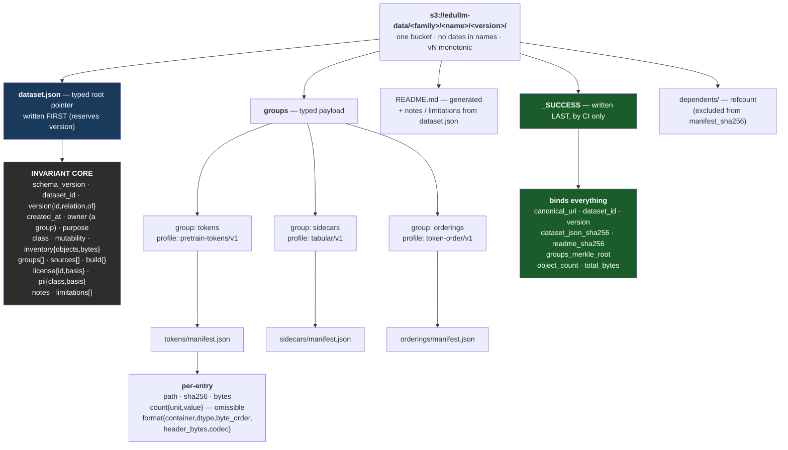

**Why `groups[]` is the key idea:** `profile`, `format`, and `partitions` all live on the *group*, not
the dataset. One dataset can hold integer tokens + float weight sidecars + index vectors without any
field having to lie.

---

## 1b. The airlock — where enforcement actually lives

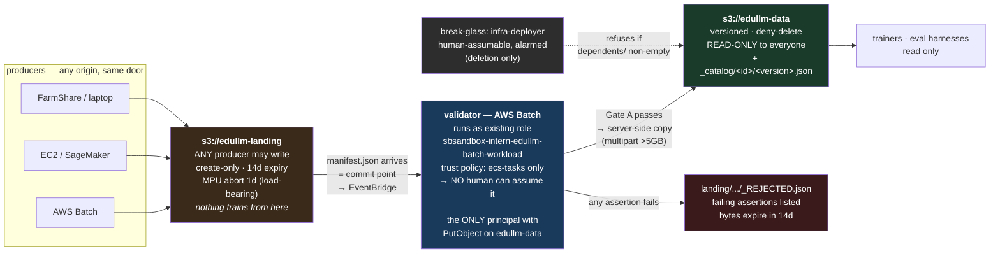

**Why an airlock beats a sentinel:** with sentinel-gating, unvalidated bytes are already sitting in the
published namespace — create-only writes mean they can never be overwritten, they're visible to anyone
globbing, and the sentinel merely declines to bless them. With an airlock they never arrive.

**Why this answers "datasets are made in AWS":** a Batch job writing straight to landing never stages a
local copy — `publish()` reads sizes and hashes via `HEAD` and no byte leaves S3. Same door as a laptop,
and strictly cheaper. There is no internal fast path to route around because there is no faster path.

---

## 2. Publish order — the chain that can't be forged

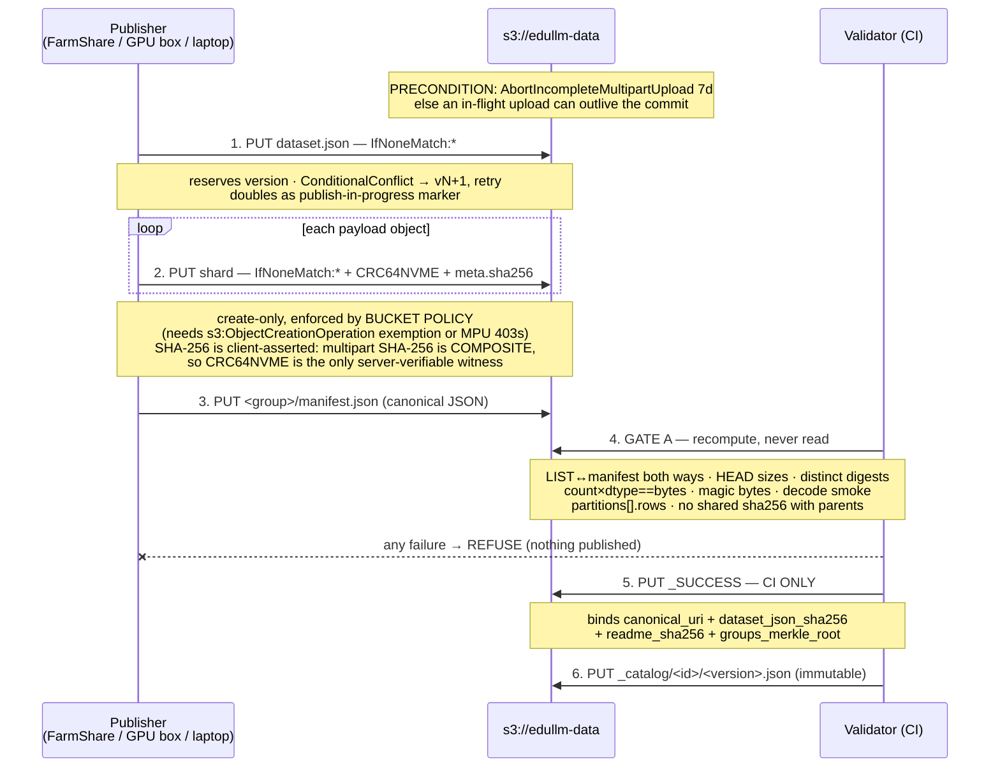

**Why CI doesn't write the bytes:** CodeBuild cannot read FarmShare `/scratch`, so CI can never be the
writer of a 633 GB corpus. Anyone writes bytes (create-only, checksummed); **only CI writes
`_SUCCESS`** — and `_SUCCESS` is what makes a dataset visible to readers.

---

## 3. Choosing a profile

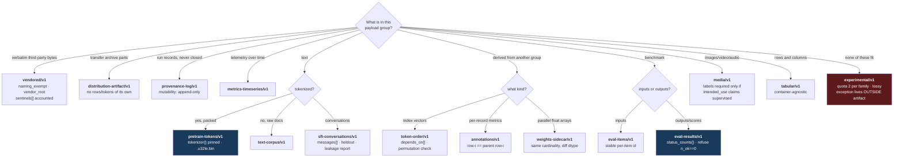

---

## 4. Validation gates — and what each one catches

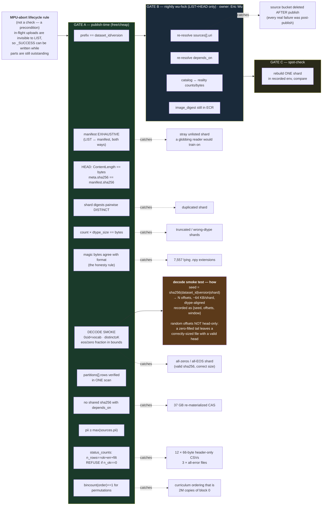

**Gate B exists because publish-time checks are architecturally mismatched to the failure history** —
every dangling pointer in the audit appeared *after* publication.

---

## 5. Referencing vs copying

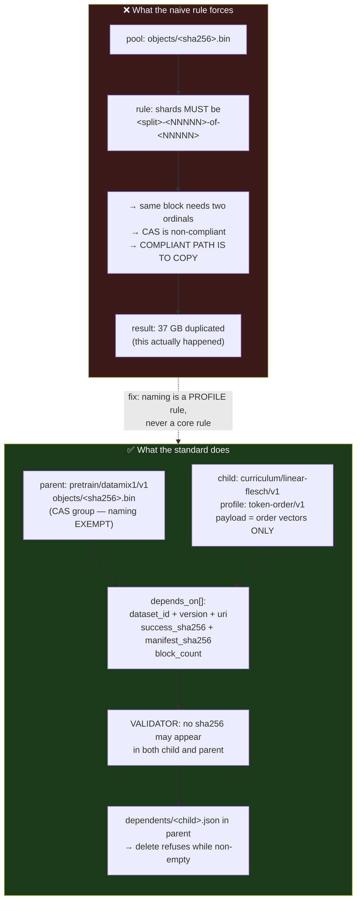

**The rule:** never make referencing harder than copying. Any standard where copying is the compliant
path will get copies.

---

## 5b. Adding a profile vs reaching for `experimental`

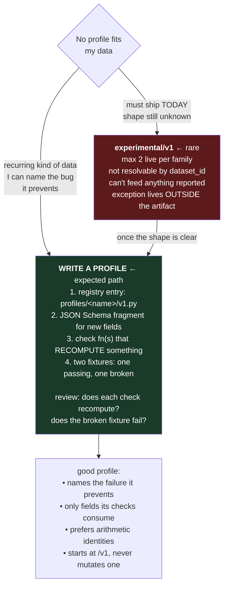

Registry grew 7 → 15 by taking real shapes seriously. It should keep growing — that's the design working,
not failing.

---

## 6. Splits that aren't directories

```mermaid
flowchart LR
  subgraph OLD["❌ splits{name → {shards,rows,tokens}}"]
    O1["assumes splits are PATHS"]
    O2["breaks: index-range holdout<br/>(source_index ≥ 1e9)"]
    O3["breaks: record-field split<br/>(meta.split)"]
    O4["breaks: peer × round × phase<br/>(3 orthogonal axes)"]
    O5["breaks: views that REPEAT blocks<br/>→ summed tokens &gt; pool tokens"]
  end

  subgraph NEW["✅ partitions[] — 4 closed forms, on the GROUP"]
    N1["by: path → glob ← the common case<br/>train-*.u32le.bin / val-*.u32le.bin"]
    N2["by: field → field + equals"]
    N3["by: range → field + min/max"]
    N4["by: indices → uri + dtype"]
    N5["<b>every form declares rows</b><br/>→ ONE scan falsifies all<br/>→ this is how train/val overlap is caught"]
    N6["coverage: partition |<br/>overlapping | incomplete<br/>(views repeat blocks → overlapping)"]
    N7["read it with:<br/>dataset_paths(id, ver, split='train')<br/>→ paths + correct dtype"]
  end

  OLD -->|"move to profile level"| NEW

  style OLD fill:#3a1a1a,color:#fff
  style NEW fill:#1a3a1a,color:#fff
```

Closed set only — no jq, no SQL, no expressions. Arbitrary predicates are unverifiable and are a
code-execution surface. Where a split is encoded twice, `by: field` is canonical and the validator
asserts the filename agrees.

---

## 7. Governance by class

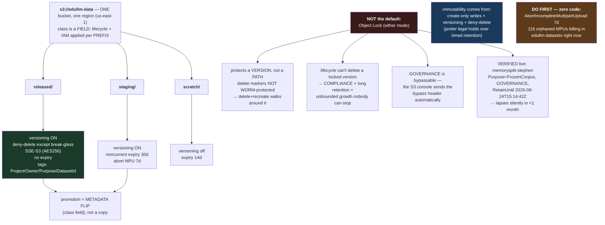

---

## 8. Cost of compliance — why the small case decides everything

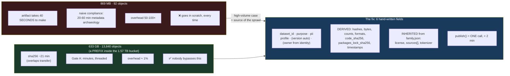

---

## 9. What was cut, and why

```mermaid
mindmap
  root((Cut from<br/>draft v0))
    Unsatisfiable
      -of-NNNNN in names
        Slurm array tasks don't know global N
        path-set equality is stronger
      image_digest required
        no container on FarmShare
      commit_sha required
        no root .git in repo
      CI-only payload writes
        CodeBuild can't read /scratch
    Self-contradictory
      3 lifecycle buckets
        promotion invalidates its own gate hash
        breaks CAS byte-sharing
      _catalog/index.json
        mutable file under create-only writes
        concurrent publishers race
    Too rigid
      dataset-level storage{}
        can't hold 2 formats in 1 dataset
      dataset-level splits{}
        splits aren't paths
        profiles disagree on split names
      scalar profile
        real datasets have many payload groups
    Unenforceable decoration
      intended_use free text
      known_limitations free text
      team
        redundant once owner is a group
      ETag as trust anchor
        multipart ETag = part count
    Counterproductive
      Object Lock COMPLIANCE default
        suppresses publishing entirely
```

---

## 10. One-screen cheat sheet

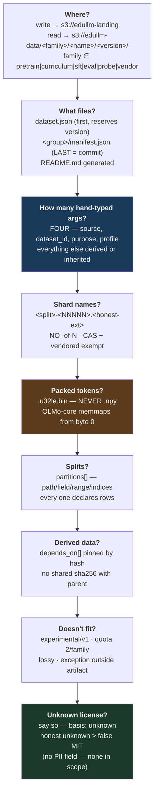
