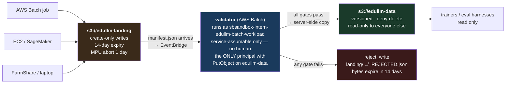

# eduLLM Dataset Standard v1

**Status:** proposed · **Date:** 2026-07-28 · **Scope:** greenfield — all datasets created from adoption forward

This document defines how datasets are laid out, described, published, and enforced. It supersedes the
governance bullet list in [`README.md`](README.md) — that list stated the right goals and was
comprehensively ignored, because it specified *outcomes* with no *mechanism*.

**Greenfield assumption.** Nothing in the current account is treated as precedent. Existing buckets,
policies, and publishers are inputs to the *diagnosis* (see
[`s3-dataset-audit-2026-07-28.md`](s3-dataset-audit-2026-07-28.md)) but not to the design. New
infrastructure, new buckets, new publisher.

**No-PII assumption.** Every dataset under this standard is non-personal: public corpora, licensed
third-party data, synthetic generations, or model outputs. There is therefore no `pii` field, no
scanner, and no PII-based routing. If that assumption ever stops holding — student records, parent
communications, anything first-party collected — this standard does not cover it and needs a revision
before such data is published.

---

## 0. First principles

**A dataset is a claim about bytes:** *these bytes have this shape, came from these sources, and are
complete.* Every real failure in the audit was a broken claim:

| Broken claim | Reality |
|---|---|
| `.npy` extension claims NumPy format | 7,557 headerless raw-uint32 objects; `np.load()` fails |
| `release.json` claims a loader, `_SUCCESS`, validation dir | none of the three exist |
| `inventory.json` claims 98 objects / 172 GB | the bucket it sits in has 10 objects / 31.7 GB |
| 12 CSVs claim to be results | 66 bytes each — header, zero rows |
| 3 files claim to be model outputs | byte-identical, every row `Finish Reason: "error"` |

So the standard has one job: **make claims machine-checkable, and make publication physically
impossible when a claim fails.** Five rules follow.

1. **Unchecked required fields are worse than absent fields.** They manufacture unearned confidence
   and train writers to fill fields ritually.
2. **The compliant path must be the cheapest path.** Compliance is ~1% overhead on a 633 GB corpus
   but would be 50–100× on a 92-file eval set — and the small case is the high-volume one that creates
   sprawl.
3. **Never make referencing harder than copying.** The audit's 37 GB duplication was
   incentive-shaped, not discipline-shaped.
4. **Validators must recompute, not read.** Schema-shape validation invites plausible garbage,
   especially from coding agents, which are excellent at satisfying schemas.
5. **Enforcement must be an IAM boundary, not a convention.** A library nobody is forced to call is a
   style guide.

---

## 1. Enforcement: the airlock

This is the central design decision, and greenfield lets us get it right.

**Two buckets. Producers can write to exactly one of them, and it is not the one anyone reads.**

```
s3://edullm-landing        ← anything may write here. Nothing trains from here.
s3://edullm-data           ← ONLY the validator role may write. Everyone reads.
```



**Why this and not "CI writes a `_SUCCESS` sentinel":** with sentinel-gating, bad bytes are *already
in the published namespace* — the sentinel merely declines to bless them. They sit there forever
(create-only writes mean you can't overwrite them), they're visible to anyone globbing, and the
namespace is polluted. With an airlock, unvalidated bytes never enter the published bucket at all.

**Why this answers the AWS-native question.** It is the same path regardless of where the dataset is
produced. A Batch job, an EC2 box, a SageMaker job, FarmShare, or a laptop all write to landing and
all get validated identically. There is no "internal" fast path to route around, because there is no
faster path — landing is the only door.

### The validator identity — reuse, don't create

`iam:CreateRole` is **explicitly denied** by the `InternSandboxBoundary` permissions boundary, so a
purpose-built `DatasetValidator` role cannot be created from an intern session. It isn't needed.

**Use the existing `sbsandbox-intern-edullm-batch-workload` role as the validator identity.** Verified
properties that make it the right choice:

- its trust policy allows **only `ecs-tasks.amazonaws.com`** — no human, and no intern role, can assume
  it. That, not the bucket policy, is the real boundary, and it already holds.
- it is the `jobRoleArn` on the active `sbsandbox-intern-edullm-cpu-run` job definition, against the
  enabled `sbsandbox-intern-edullm-cpu` queue — so the execution path exists today.
- `iam:PutRolePolicy` on it is **allowed** from an intern session, so the validator's S3 grants can be
  attached without creating anything.

Attach an inline policy (`dataset-validator`) granting `s3:PutObject` + `s3:AbortMultipartUpload` on
`arn:aws:s3:::edullm-data/*` and read on `arn:aws:s3:::edullm-landing/*`. Note the role already carries
an inline `write-team-outputs-only` policy — add alongside it, don't replace it.

The bucket policy on `edullm-data`:

```json
{"Sid": "OnlyValidatorWrites", "Effect": "Deny", "Principal": "*",
 "Action": ["s3:PutObject", "s3:DeleteObject", "s3:DeleteObjectVersion",
            "s3:PutObjectTagging", "s3:AbortMultipartUpload"],
 "Resource": "arn:aws:s3:::edullm-data/*",
 "Condition": {"ArnNotEqualsIfExists": {"aws:PrincipalArn": [
   "arn:aws:iam::<ACCOUNT_ID>:role/sbsandbox-intern-edullm-batch-workload",
   "arn:aws:iam::<ACCOUNT_ID>:role/sbsandbox-intern-edullm-infra-deployer"]}}}
```

Four things that make this real rather than decorative:

1. **The validator role is service-assumable only.** Verified above. This is the load-bearing fact.
2. **`aws:PrincipalArn` holds the *role* ARN, never the session ARN.** Writing the
   `arn:aws:sts::…:assumed-role/Role/session` form makes the condition always true and the Deny fires
   on everyone. This is the single most common way this policy is misbuilt.
3. **Never put `s3:*` or `s3:Put*` in the Deny** — catching `PutBucketPolicy` is a hard lockout that
   binds root and needs AWS Support to undo. Data-plane actions only.
4. **Break-glass**: `sbsandbox-intern-edullm-infra-deployer` stands in for a dedicated deletion role
   until one can be created. A published dataset will eventually need removing; use of this path should
   be alarmed.

**Do not weaken this to "producers write to `edullm-data`, just don't publish there by convention."**
That is precisely the shape of the policy this standard replaces — a rule with no mechanism. If
producers hold `PutObject` on the read bucket, the airlock provides nothing.

**Known gap, stated plainly:** because the validator shares a role with general Batch workloads, any
Batch job on that queue inherits write access to `edullm-data`. That is weaker than a dedicated role.
Two mitigations, in order of preference: (a) request a dedicated `DatasetValidator` role from an admin
when convenient — it is a one-line ask, not an access negotiation; or (b) scope the inline policy with
a condition on the job-definition ARN. Until then, this is still strictly stronger than any convention,
because no *human* principal can write to `edullm-data` at all.

### What can be built without an admin

Verified by live smoke test (a probe bucket was created, configured, and deleted):

Every action on the critical path was smoke-tested live (probe buckets and rules were created, exercised,
and deleted). Nothing below is inferred.

| Action | Status | How verified |
|---|---|---|
| `s3:CreateBucket` | ✅ | probe bucket created |
| `s3:PutBucketPolicy` | ✅ | conditional-write Deny applied |
| `s3:PutBucketVersioning` | ✅ | set to Enabled |
| `s3:PutBucketLifecycleConfiguration` | ✅ | MPU-abort rule applied |
| `s3:PutBucketNotificationConfiguration` | ✅ | `EventBridgeConfiguration` set and read back |
| `events:PutRule` / `DeleteRule` | ✅ | rule created and deleted |
| `events:PutTargets` / `RemoveTargets` | ✅ | real Batch-queue target attached, `FailedEntryCount: 0` |
| `batch:SubmitJob` | ✅ | rejected an *argument*, not the identity — authorization passed |
| `batch:DescribeJobs` | ✅ | returned an empty result, not AccessDenied |
| `ecr:GetAuthorizationToken` | ✅ | token issued |
| `iam:PutRolePolicy` on the workload role | ✅ | simulator-confirmed allowed |
| `iam:PassRole` | ✅ | simulator-confirmed allowed |
| `batch:RegisterJobDefinition` / `DeregisterJobDefinition` | ✅ | probe definition registered at revision 1, then deregistered |
| `iam:CreateRole` | ❌ denied by `InternSandboxBoundary` | **not needed** — design reuses an existing role |

**Do not trust `iam:simulate-principal-policy` for this role.** It reported `explicitDeny` for
`CreateBucket`, `PutBucketPolicy`, `PutRule`, `SubmitJob`, `DescribeJobs`, `PutTargets`,
`PutBucketNotification`, `RegisterJobDefinition`, and both ECR actions — **all eleven of which work.**
Smoke-test instead.

### Running the validator

Two options, both available. `batch:RegisterJobDefinition` **is** permitted (verified), so the earlier
constraint that forced command-override reuse no longer applies.

**Preferred — register a dedicated `edullm-validator` job definition.** Bake `vcpus`, `memory`, the
`jobRoleArn`, and a **self-discovering default command** into the definition. Self-discovery matters: it
dissolves the input-passing problem in §"Event wiring" below, because the container scans landing for
unsealed manifests instead of needing the triggering key handed to it. Registering revision N is a normal
deploy step, and it removes the risk of a submitter forgetting the overrides.

**Fallback — reuse `sbsandbox-intern-edullm-cpu-run`** (revision 1, `container`) with a command override.
Its default command is `python -c 'print("…no command override was supplied")'` and its image is
digest-pinned to `sbsandbox-intern-edullm-olmo-core@sha256:4ebdba1b…`.

```bash
aws batch submit-job \
  --job-name validate-eval-mcq-arc-v1 \
  --job-queue sbsandbox-intern-edullm-cpu \
  --job-definition sbsandbox-intern-edullm-cpu-run \
  --container-overrides '{"command":["python","-m","edullm_data.validate",
                                     "--landing-uri","s3://edullm-landing/eval/mcq-arc/v1/"],
                          "vcpus":4,"memory":8192}'
```

Two consequences of the fallback path:

1. **`vcpus` and `memory` are `null` on that definition**, so every submission must supply them in the
   override or the job fails to place. Bake this into the submitter, never into documentation.
2. **The image is digest-pinned**, so the validator must either live in the image or be fetched at
   container start (`uv pip install "edullm-data @ git+…@v0.1.0"`). Fetch-at-start is fine for v1 and
   avoids needing `ecr:PutImage`; move it into the image if cold-start cost matters.

### Event wiring — two constraints EventBridge cannot solve

`s3:PutBucketNotificationConfiguration` and `events:PutTargets` both work, so the event-driven path is
available with no polling fallback. But `PutTargets` returning `FailedEntryCount: 0` proves only that the
target was *accepted* — it does not validate invocation. Two real problems, both verified:

**1. The invocation role must trust `events.amazonaws.com`.** `sbsandbox-intern-edullm-batch-workload`
trusts **only `ecs-tasks.amazonaws.com`** (verified) — which is precisely the property the airlock depends
on, so it must not be widened. Use **`CloudWatchSendEventsToVdi`** as the rule's `RoleArn` instead: it
trusts `events.amazonaws.com` (verified) and is the correct EventBridge invocation identity. The *job*
still runs as `…-batch-workload` via the job definition's `jobRoleArn`, so the writer to `edullm-data` is
unchanged.

**2. `BatchParameters` cannot pass the triggering object key.** It has four members and no
`InputTransformer` path to the container. With revision 1 that is actively dangerous: its default command
prints a message and **exits 0**, so a rule that placed a job would report success while validating
nothing — a decorative mechanism, exactly what §0 rule 5 forbids.

**Fix: a self-discovering validator.** The container lists landing for manifests without a matching
`_VALIDATED`/`_REJECTED` marker and processes all of them. The event becomes a pure "wake up" signal
carrying no payload, which also makes the following harmless:

- the `suffix: manifest.json` matcher over-matches `foo-manifest.json`
- multi-group datasets fire the rule once **per group**, so Gate A may be invoked before the last group
  seals

Both mean **Gate A must be idempotent and must tolerate a partially-sealed dataset** — sealing only when
every group in `dataset.json` has a manifest. No event pattern can fix this; it is a validator-side
requirement.

Ship the rule **DISABLED** until the self-discovering definition exists. An enabled rule that fails every
invocation surfaces only as a CloudWatch metric, which is worse than no rule.

**Promotion is a server-side copy**, so bytes never transit a client. Costs: ~$0.07 in requests for
13,840 objects, free same-region transfer, and a few hours of double storage (pennies). Note
`CopyObject` caps at 5 GB single-part — the validator must use multipart copy, since 8 of the 15
largest objects in the audit exceeded that.

**If you later get org-level access**, an SCP denying `s3:PutObject` on `edullm-data` to everything
except the validator role makes this stronger still, because it binds account admins too. Worth
asking for; not a blocker.

---

## 2. Location and naming

```
s3://edullm-data/<family>/<name>/<version>/
```

`<version>` is `v1`, `v2`, … monotonic per name, auto-allocated. Never typed by hand.

### `<family>` — a fixed enum

`pretrain` · `curriculum` · `sft` · `eval` · `probe` · `vendor`

Fixed on purpose. A free-text family segment becomes a second naming problem. Adding a family is a
deliberate change to this document.

### `<name>` — rules

- kebab-case, lowercase, 2–5 words
- names **what the data is** plus **the one axis that distinguishes it from its siblings**
- **no dates** (`datamix1-jul22` holds objects dated 2026-07-28)
- **no version tokens** — `v2`, `final`, `new`, `latest`, `fixed` (version is a separate segment)
- **no person names**, no ticket ids, no `test`/`tmp`/`scratch`
- **no relative words** — `big`, `small`, `improved`, `better`

### Examples — good

| Name | Why it works |
|---|---|
| `pretrain/dolma2-150b` | corpus + token budget; the budget is the distinguishing axis |
| `pretrain/olmo-mix-1124-30b` | upstream release code + budget |
| `pretrain/refhq-regmix-5b5` | source + selection method + budget |
| `pretrain/fineweb-edu-10b` | corpus + budget |
| `curriculum/flesch-linear-370m` | difficulty signal + schedule shape + target model |
| `curriculum/zlib-strict-370m` | same axes, different values — siblings read clearly |
| `sft/pedagogical-tutoring-100students` | task + the scale that defines it |
| `sft/tulu3-mix` | upstream mix, no invented name |
| `eval/mcq-arc-openbookqa-sciq` | task type + exactly which benchmarks |
| `eval/tutorbench-responses` | benchmark + what kind of artifact |
| `eval/judge-blinded-5x5` | protocol + design shape (5 judges × 5 variants) |
| `probe/s5-parity-solvable` | task + the condition being probed |
| `probe/multihop-wikidata-4hop` | task + source + depth |
| `vendor/dclm-hero-run-fasttext` | upstream name preserved verbatim |

### Examples — reject these

| Name | Problem |
|---|---|
| `pretrain/datamix1-jul22` | date, plus `1` is a meaningless ordinal |
| `pretrain/new-corpus` | relative; meaningless in six weeks |
| `pretrain/final-v2` | version in the name, and "final" never is |
| `pretrain/eric-test` | person + no content |
| `pretrain/data` | says nothing |
| `eval/results` | says nothing; every eval has results |
| `curriculum/experiment-3` | ordinal with no semantics |
| `sft/good-data` | relative and unfalsifiable |
| `pretrain/dolma2_150B` | snake_case + capitals |
| `eval/mcq-v2-fixed-final` | three version tokens |

**Test for a name:** if two people independently made this dataset, would they land on the same name?
And could you tell it apart from its five nearest siblings without opening it? If not, the name is
carrying too little of the distinguishing axis.

### `purpose` — one line, states the decision it supports

Good purposes name the artifact, the consumer, and what question it answers.

**Good:**
- `"150B-token Dolma2 mix for 370M ladder pretraining at 1.25xC"`
- `"Curriculum ordering by Flesch reading ease for the 370M difficulty-ordering ablation"`
- `"ARC/OpenBookQA/SciQ loglikelihood scores for 23 baseline models, for the adaptive-inference baseline table"`
- `"Blinded judge verdicts, 5 judges x 5 prompt variants x 3 replicates, to measure judge reliability"`
- `"Held-out synthetic reasoning items, 14 tasks x 512, for the memory-split dense-vs-sparse comparison"`
- `"Retention corpus of general text to measure forgetting during distillation"`

**Reject:**
- `"training data"` — every dataset is
- `"the dataset"` / `"data from the run"` — no content
- `"TODO"` / `"tbd"` — will never be filled in
- `"corpus for the project"` — which corpus, which project
- `"experiments"` — not an artifact description
- `"see README"` — the README is generated *from* this field

**Shape to aim for:** `<what it is> for <what consumes it> to <what it decides>`.

### Version allocation

`vN` has no natural allocator, which is why dates proliferate — they're a decentralized one. The
publisher reserves the version by writing `<version>/dataset.json` to landing with `IfNoneMatch="*"`
**before uploading any bytes**; on conflict it increments and retries. Sub-second loop against a small
object, and it doubles as a publish-in-progress marker.

`version` carries a relation, because monotonic ordering can't express everything real:

```json
"version": {"id": "v3", "relation": "supersedes", "of": "v2"}
```

`relation ∈ {supersedes, extends, sibling}`. `extends` covers a corpus whose `extension/` generation
is consumed *alongside* its base. `sibling` covers two snapshots whose order is genuinely unknown —
better than fabricating one.

---

## 3. The invariant core

```json
{
  "schema_version": "edullm-dataset/v1",
  "dataset_id": "pretrain/dolma2-150b",
  "version": {"id": "v1", "relation": "supersedes", "of": null},
  "created_at": "2026-07-28T14:03:11Z",
  "owner": "edullm-data@alphaaiengineering.com",
  "purpose": "150B-token Dolma2 mix for 370M ladder pretraining at 1.25xC",
  "mutability": "frozen",
  "inventory": {"objects": 13840, "bytes": 633511277765},
  "groups": [
    {"name": "tokens", "profile": "pretrain-tokens/v1",
     "prefix": "tokens/", "manifest": "tokens/manifest.json",
     "manifest_sha256": "..."},
    {"name": "sidecars", "profile": "tabular/v1",
     "prefix": "sidecars/", "manifest": "sidecars/manifest.json",
     "manifest_sha256": "..."}
  ],
  "sources": [...],
  "build": {...},
  "license": {"id": "ODC-By-1.0", "basis": "inherited"},
  "notes": "free text: footguns, judgment calls, warnings",
  "limitations": [{"kind": "contamination", "benchmark": "gsm8k",
                   "overlap_rate": 0.003, "method": "13-gram"}]
}
```

`mutability ∈ {frozen, append-only, live}` — the manifest hash is required only for `frozen`. Without
this an append-only provenance log would be permanently "incomplete" by the standard's own definition.

`license{id, basis}` where `basis ∈ {declared, inherited, unknown}`. An honest `unknown` is worth more
than a false `MIT`, and it's queryable in the catalog.

`notes` and `limitations[]` exist because the README is generated. The single most useful sentence in
the whole account is hand-written prose — *"the `.npy` suffix does not imply a NumPy header"* — and a
generated README with no free-text field would delete it.

### `build` — stronger when produced in AWS

This is where AWS-native production genuinely wins. A discriminated union:

```json
// produced in AWS — provenance is captured automatically from the environment
"build": {
  "executor": {"kind": "aws-batch",
               "job_id": "8f2c...", "job_attempt": 1,
               "job_definition_arn": "arn:aws:batch:...:job-definition/tokenize:12",
               "image_digest": "sha256:...", "region": "us-east-1"},
  "command": [...], "seed": 6198,
  "env": {"PYTHONHASHSEED": "0", "LC_ALL": "C.UTF-8", "TZ": "UTC", "OMP_NUM_THREADS": "8"},
  "reproducibility": "logical"
}
```

```json
// produced outside AWS
"build": {
  "executor": {"kind": "external", "host_class": "farmshare-slurm",
               "code_sha256": "...", "packages_lock_sha256": "..."},
  "command": [...], "seed": 6198, "env": {...}, "reproducibility": "logical"
}
```

For AWS producers the publisher reads `AWS_BATCH_JOB_ID`, the job-definition ARN, and the container
image digest from the task metadata endpoint — **nothing typed, and `image_digest` becomes obtainable**,
which is why it was dropped as a universal requirement but is required for `kind: aws-batch`. The
validator asserts the image digest still exists in ECR, and ECR lifecycle must exempt referenced
digests.

`reproducibility ∈ {bitwise, logical}` — most datasets are only logically reproducible; declaring
`bitwise` falsely is the same class of error as the `.npy` lie.

**Domain-separated seeds.** A single `seed` means reordering pipeline stages silently rewires the RNG
stream. Derive per-item randomness as `sha256(domain ‖ seed ‖ stable_id)` so it is order-independent
and shard-local.

---

## 4. Profiles — the flexibility mechanism

### What a profile is

A profile is a **named contract attached to a payload group**. It does exactly two things:

1. **Adds required fields** to that group's metadata.
2. **Adds validator checks** that run against that group's bytes.

That's it. It is not a folder, not a class hierarchy, not a schema you inherit from. It's the answer to
"what does it mean for *this kind of thing* to be correct?"

### Why not one schema for everything

A packed token corpus and an eval-results CSV share almost nothing worth checking. Tokens need a
tokenizer pin, a vocabulary bound, and byte-alignment arithmetic. Eval results need a model pin, decode
parameters, and a refusal when every row is an error. A single schema covering both would require every
field to be optional — and optional-everything checks nothing.

So the core stays tiny (things true of *all* bytes: identity, ownership, provenance, inventory,
manifest), and everything kind-specific lives in a profile.

### Why the profile is on the *group*, not the dataset

This is the structural decision that makes the standard fit reality. Real datasets contain several
structurally different payload groups:

```
s3://edullm-data/pretrain/dolma2-150b/v1/
├── dataset.json
├── tokens/                      ← profile: pretrain-tokens/v1
│   ├── manifest.json               dtype uint32, headerless, vocab-bounded
│   └── train-00000.u32le.bin …
└── sidecars/                    ← profile: tabular/v1
    ├── manifest.json               gzipped CSV, 5 declared columns
    └── train-00000.csv.gz …
```

One dataset, two profiles, one atomicity gate. If `profile` sat on the dataset, you would have to
either lie about half the files or split them into two datasets that must never drift apart. The same
structure handles: a token pool plus ten curriculum orderings; identical integer tokens with two
different float weight-sidecar arms; and a curriculum release with six payload groups.

### Two worked examples

**`pretrain-tokens/v1`**

| Adds required fields | Adds checks |
|---|---|
| `tokenizer{repo_id, revision, fingerprint_sha256, vocab_size, eos_token_id}` | `bytes % (dtype_size × seq_len) == 0` |
| per-entry `format{container, dtype, byte_order, header_bytes, codec}` | decode N tokens/shard: `0 ≤ id < vocab_size` |
| token counts per shard | `distinct_token_ids ≥ K` (catches all-zeros, all-EOS) |
| | `count.value × dtype_size == bytes` |
| | extension matches format — `.u32le.bin`, never `.npy` |

**`eval-results/v1`**

| Adds required fields | Adds checks |
|---|---|
| `model{id, revision}` | `n_rows == n_ok + n_error + n_filtered` |
| `task`, decode params (temp, top_p, max_tokens) | **refuse if `n_ok == 0`** |
| `status_counts{}` | `n_ok / n_rows ≥ declared_min` |
| | metric values not all-identical |

That second table is what catches the audit's real bug. The 12 header-only CSVs die on `n_ok == 0`.
The three all-error files die on the same check — they had honest nonzero `n_rows`, so row-count
validation alone would have passed them.

### The registry

| Profile | Payload | Adds |
|---|---|---|
| `pretrain-tokens/v1` | packed token shards | tokenizer pin; vocab bound; alignment arithmetic |
| `text-corpus/v1` | raw untokenized documents | record schema; text field name |
| `sft-conversations/v1` | instruction / conversation | `messages[]` schema; heldout partition; dedup + leakage report |
| `eval-items/v1` | benchmark inputs | stable per-item id |
| `eval-results/v1` | model outputs / scores | model pin; decode params; failure accounting |
| `annotations/v1` | per-record derived metrics | `parent_group`; row-*i*-is-parent-row-*i* |
| `token-order/v1` | index vectors (views, curricula) | `depends_on[]`; permutation check |
| `weights-sidecar/v1` | parallel float arrays | `parent_group`; identical cardinality, different dtype |
| `tabular/v1` | any container | declared column schema (container-agnostic) |
| `media/v1` | image / video / audio | decode facts; label index if supervised use claimed |
| `metrics-timeseries/v1` | telemetry | timestamp field; no splits or license required |
| `provenance-log/v1` | run records | `mutability: append-only`; entity-per-prefix |
| `vendored/v1` | verbatim third-party | `upstream{}`; `vendor_root`; naming exempt; `sentinels[]` |
| `distribution-artifact/v1` | transfer archives | `packages{}` + part checksums |
| `experimental/v1` | escape hatch | see §7 |

### Versioning rule

**Always validate against the profile version pinned in the artifact, never "latest."** Otherwise the
first field added in `pretrain-tokens/v2` retroactively invalidates every v1 dataset and mass-migrates
everyone to `experimental` in a single commit.

### Choosing one

Walk the decision tree in
[`DATASET-STANDARD-DIAGRAMS.md`](DATASET-STANDARD-DIAGRAMS.md) §3.

### Adding a profile — the expected path, not an exception

**If nothing fits, write a profile.** This is normal and encouraged; the registry grew from 7 to 15
entries precisely by taking real dataset shapes seriously, and it will keep growing.

Use `experimental/v1` only when you must ship *today* and don't yet know the shape. Write a profile when
the shape is a real recurring kind of data. The second should be common, the first rare — that is what
the quota of 2 in §8 is for.

A profile is four small things:

1. **A registry entry** — `profiles/<name>_v1.py` (flat, e.g. `profiles/pretrain_tokens_v1.py`), exporting
   `REQUIRED_FIELDS` and `CHECKS`.
2. **A JSON Schema fragment** for the fields it adds to a group's metadata.
3. **One or more check functions**, each `(group, manifest, s3) -> list[Violation]`. A check must
   **recompute** something, not merely assert a field is present — a check that only reads metadata adds
   ceremony without adding safety.
4. **Two fixtures** — one tiny passing example, one deliberately broken, so the check is proven to fire.

What makes a good profile:

- **Name the failure you are preventing.** `eval-results/v1` exists because 12 header-only CSVs and 3
  all-error files were indistinguishable from real results by listing. If you cannot name the bug, the
  profile probably isn't needed.
- **Add only fields your checks consume.** A required field no check reads is decoration.
- **Prefer arithmetic identities.** `count × dtype_size == bytes` is worth more than five schema fields.
- **Start at `/v1`, and never mutate a published version.** Add `/v2` and leave `/v1` valid, since
  artifacts are validated against the version they pin.

Review criteria for the PR: does each check recompute something, and does the broken fixture fail?

---

## 5. Manifests, format, and naming

### Format is per-file

```json
{"path": "tokens/train-00000.u32le.bin", "sha256": "...", "bytes": 536870912,
 "count": {"unit": "tokens", "value": 134217728},
 "format": {"container": "raw", "dtype": "uint32", "byte_order": "little",
            "header_bytes": 0, "codec": "none"}}
```

`count{unit, value}` with `unit ∈ {rows, tokens, items, indices, bytes}`, **omissible** — a tar part or
a `.done` sentinel has no honest count. `bytes` and `sha256` always required. Omit the key entirely rather
than writing `null`, so "no honest count" can't be misread as "count of zero".

Three qualifiers on the arithmetic identity (`count.value × dtype_size == bytes`), all load-bearing:

- It applies **only to fixed-width containers with no codec.** Under compression `bytes` is the *encoded*
  size, so the identity is meaningless rather than violated — a gzipped token shard must not fail this gate.
- `unit: bytes` is **not** fixed-width for this purpose; asserting it would demand `dtype_size == 1`.
- `header_bytes` is added to the expected size. It is 0 in every case this standard describes, so the
  check reduces to the literal identity.

**Shard ordinals are 5 digits** (`train-00000`), capping a group at 100,000 shards — well above the
current maximum of 13,840. Exceeding it is a spec amendment, not a code change.

### The honesty rule

**An extension MUST NOT contradict the declared `format`.**

This needs **two independent checks**, and they are not redundant:

1. **Extension ↔ metadata agreement** (cheap, no payload read) — catches `.npy` declared as
   `container: raw, header_bytes: 0`.
2. **Magic-byte sniff** (§7's decode smoke test) — catches the case check 1 cannot: a writer who names a
   file `.npy` *and* declares `container: "npy"` is internally self-consistent, so only reading the first
   bytes and finding no `\x93NUMPY` exposes it. This is the audit's actual 7,557-object case.

Skip either and the lie survives.

Packed uint32 tokens are `.u32le.bin`. **Never `.npy`.** OLMo-core reads token files with
`np.memmap(path, mode="r", dtype=dtype)` (`olmo_core/data/utils.py:158`) and derives token count from
raw file size (`:233`). A real `.npy` header would corrupt leading tokens *and* the count. And
`format.dtype` must be declared and read, never inferred — OLMo-core defaults to `uint16` while these
corpora are `uint32`, which silently halves the count.

### Shard naming: no `-of-N`

```
<split>-<NNNNN>.<self-describing-ext>
```

`-of-NNNNN` is **unknowable at write time** — parallel workers tokenize independently and the surviving
shard count depends on filtering that hasn't run yet. Completeness is proven better by path-set
equality against the manifest, reporting `missing=` and `extra=`.

Naming is a **profile-level** rule. Content-addressed groups are exempt (`objects/<sha256>.bin` *is*
the dedup mechanism — mandating ordinals over a CAS forces the same block under two names, making
copying the compliant path). Vendored trees are exempt (renaming destroys upstream verifiability).

### Manifest must be exhaustive

**No unlisted objects under a group prefix**, checked in both directions. Cheapest completeness win
available, and it closes the hole where a stray shard gets silently trained on by a globbing reader.

---

## 6. Publishing

Producers call one function. It writes to **landing**, never to `edullm-data`.

```python
publish(source,
        dataset_id="eval/mcq-arc",
        purpose="ARC/OpenBookQA/SciQ loglikelihood scores for 23 baseline models, "
                "for the adaptive-inference baseline table",
        profile="eval-results/v1")
```

**Four things you type:**

| # | Argument | Notes |
|---|---|---|
| 1 | `source` | a local path **or** an `s3://edullm-landing/...` URI. If local, the publisher uploads it; if already in landing (the AWS-native case — your Batch job wrote there directly), it only seals. |
| 2 | `dataset_id` | `<family>/<name>` per §2 |
| 3 | `purpose` | one line per §2 |
| 4 | `profile` | a string, or a dict for multi-group: `{"tokens": "pretrain-tokens/v1", "sidecars": "tabular/v1"}` |

**Derived, never typed:** `version` (allocated), `owner` (IdP group), `created_at`, `inventory`, every
`sha256`/`bytes`/`count`, `format{}` (magic bytes + writing dtype), `build.executor` (from Batch/ECS
metadata, or code+lock hashes externally), `build.env`, `mutability`.

**Inherited from `<family>/family.json`, written once per family:** `license`, `sources[]`,
`tokenizer{}`. This is what keeps small datasets cheap — write `eval/family.json` once and every future
eval set inherits its license and tokenizer pins free.

### The AWS-native path

A Batch job that writes its output straight to landing never stages a local copy:

```python
# inside the Batch job, after writing shards to s3://edullm-landing/eval/mcq-arc/_pending/
publish("s3://edullm-landing/eval/mcq-arc/_pending/",
        dataset_id="eval/mcq-arc", purpose="...", profile="eval-results/v1")
```

`publish()` reads sizes and hashes via `HEAD`, builds the manifest, and writes it. No byte leaves S3.
This is strictly cheaper than the external path and is the mode to prefer.

### Order

1. `dataset.json` → landing, `IfNoneMatch:*` (reserves the version)
2. payload objects → landing, `IfNoneMatch:*`
3. per-group `manifest.json` → landing, **last**

Step 3 is the commit point. Its arrival fires EventBridge → validator.

The **manifest**, not a sentinel, is the commit: it enumerates every member with size and checksum, so
completeness is provable rather than inferred. A content-free flag can't distinguish "done" from "done
except the 13 GiB member still uploading" — in-flight multipart uploads are invisible to `LIST`, which
is exactly why landing needs a 1-day MPU-abort rule.

---

## 7. Validation — recompute, never read

The validator is the only writer to `edullm-data`. **It runs on AWS Batch, one path for every dataset
size** — no Lambda tier and no size dispatch in v1. A single execution route is easier to reason about,
and Lambda's 15-minute ceiling cannot decode-test a 633 GB corpus anyway. Small datasets pay a queue wait
of a minute or two, which nobody will notice.

**Gate A — always:**
- `dataset_id` / `version` match the landing prefix; `<family>` in the enum; `<name>` matches the
  naming rules in §2 (mechanical: charset, no dates, no version tokens, no banned words)
- manifest **exhaustive** — `LIST` vs manifest, both directions
- per shard `HEAD`: `ContentLength == bytes`
- shard digests **pairwise distinct**
- `count.value × dtype_size == bytes` for fixed-width containers — the arithmetic identity that
  exposed the fake `.npy` files (`86,096,509 × 4 = 344,386,036` = exact object size)
- magic-byte sniff agrees with `format`
- group manifest sums equal `inventory`
- every `partitions[].rows` verified in one scan
- **decode smoke test** per profile (below)
- no shared `sha256` with any `depends_on` dataset
- `build.executor.image_digest` still resolves in ECR (for `kind: aws-batch`)
- profile-specific checks (§4)

Pass → server-side copy to `edullm-data` → write `_catalog/<dataset_id>/<version>.json`.
Fail → write `landing/<...>/_REJECTED.json` with the failing assertions; bytes expire in 14 days.

### The decode smoke test

Every other gate proves bytes are **intact**. This one proves they are **plausible**. A shard of all
zeros with the correct size and a valid SHA-256 passes every integrity check ever written, and trains to
nothing. This is the only gate that reads payload, so it runs last.

**Sampling: seeded random offsets, ~64 KB per shard.**

```python
rng_seed = sha256(f"{dataset_id}|{version}|{shard_path}").hexdigest()[:16]
# → N offsets uniformly over [0, bytes - window), aligned down to a dtype boundary
```

Deterministic (any auditor can re-run the identical sample), recorded in the validation report as
`{seed, offsets, window_bytes}`, and cheap: 64 KB × 13,840 shards ≈ 885 MB, seconds on Batch.

Random offsets rather than the first N bytes because **a zero-filled or truncated tail is a real failure
mode** — a crashed writer leaves a correctly-sized file whose head is perfectly valid. Head-only
sampling misses it entirely.

`pretrain-tokens/v1` assertions per shard:

| Assertion | Catches |
|---|---|
| `0 ≤ token_id < vocab_size` | wrong dtype, wrong endianness (uint16-vs-uint32 sends IDs past vocab) |
| `distinct_ids ≥ K` | all-zeros, all-one-token |
| `eos_fraction` in declared bounds | all-EOS shard |
| `zero_fraction` in declared bounds | partial zero-fill from a crashed writer |
| first bytes are **not** `\x93NUMPY` | a real `.npy` header where headerless was declared |
| `bytes % (dtype_size × seq_len) == 0` | truncation mid-sequence |

`eval-results/v1` reads rows instead: `n_rows == n_ok + n_error + n_filtered`, **refuse if
`n_ok == 0`**, and reject when all metric values are identical. That combination is what kills both the
12 header-only CSVs *and* the three all-error files — the latter had honest nonzero `n_rows`, so
row-count validation alone would have passed them.

Bounds (`K`, `eos_fraction`, `zero_fraction`) are declared per dataset in the profile block, with
registry defaults. Declaring an absurd bound to pass is possible but visible in review — and unlike a
silent default, it is a recorded claim.

**Gate B — nightly `wu-fsck`** (LIST + HEAD only, cents per run). Named for its owner, **Eric Wu** —
deliberately, because an unowned nightly job gets muted after its first false alarm and becomes
decoration. Ownership transfers by renaming.

Every audit failure was **post-publish decay**, which no publish-time gate can catch:

| Re-checks | The failure it catches |
|---|---|
| `sources[].uri` still resolves | `edullm-dataset-refhq` is 404 today; a live manifest still cites it |
| `depends_on` parents still exist | a view whose token pool was deleted underneath it |
| catalog counts == reality | the `inventory.json` claiming 98 objects / 172 GB in a bucket holding 10 / 31.7 GB |
| `build.executor.image_digest` in ECR | ECR lifecycle expiring untagged images, silently killing reproducibility |
| no unlisted objects under a group prefix | a stray shard added after publication |

Output: a report of broken references, plus an alarm on any transition from healthy to broken. No
payload reads, so cost is cents per run regardless of corpus size.

**Gate C — rebuild spot-check.** Rebuild **one** shard in the recorded executor and compare. 1/70th of
build cost; converts the central claim from asserted to tested.

### Checksum reality

For any object above the multipart threshold, **SHA-256 is COMPOSITE-only** — a hash of part hashes,
not the object's digest. Only CRC32/CRC32C/CRC64NVME linearize to a full-object value.

- Publisher sets **CRC64NVME** as the S3-verifiable witness.
- Manifest `sha256` is explicitly a **client assertion**, used for content addressing. Do not claim S3
  verifies it.
- **ETag is not a content hash** for multipart or SSE-KMS objects — it's a part count (`…-1698`).
- `CopyObject` **changes** the checksum of a formerly-multipart object even with identical bytes, so
  the validator must compare its own recomputation, not a read-back value.

### Splits: train / val / test

Splits are **not directories**. They are declared in `partitions[]` on the *group*, because real splits
in this account are not all path-shaped: one holdout is an index range, one is a record field, and the
curriculum views repeat blocks so their partitions genuinely overlap.

The common case stays boring — a glob, exactly what you'd expect:

```json
"partitions": [
  {"name": "train", "by": "path", "glob": "train-*.u32le.bin", "rows": 2265984},
  {"name": "val",   "by": "path", "glob": "val-*.u32le.bin",   "rows": 4096}
],
"coverage": "partition"
```

Reading a split is one call, which resolves the partition and returns the right dtype:

```python
paths, dtype, kwargs = dataset_paths("pretrain/dolma2-150b", "v1", split="train")
```

Two rules make splits a checked claim rather than folklore:

1. **Every partition declares `rows`.** One scan falsifies all of them at once — and that is how a
   train/val overlap gets caught.
2. **`coverage ∈ {partition, overlapping, incomplete}`** tells a tool whether summing rows is
   legitimate. Curriculum views repeat blocks, so summing their partitions would double-count.

Split *names* are profile vocabulary, not core vocabulary, because the profiles legitimately disagree:
`pretrain-tokens` has train and optional val but no test; `sft-conversations` requires a heldout;
`eval-items` is entirely test. Putting the names in the core would force one of those three to lie.

The four forms, a closed set:

```json
[{"name": "train",   "by": "path",    "glob": "train-*.u32le.bin",           "rows": 2265984},
 {"name": "seen",    "by": "field",   "field": "meta.split", "equals": "seen", "rows": 512},
 {"name": "holdout", "by": "range",   "field": "source_index", "min": 1000000000, "rows": 7168},
 {"name": "keep",    "by": "indices", "uri": "excluded.u32", "dtype": "<u4",  "rows": 2265984}]
```

Closed set — no jq, no SQL, no expressions (unverifiable, and a code-execution surface). **Every
partition declares `rows`**, so one scan falsifies all of them. `coverage ∈ {partition, overlapping,
incomplete}` tells a tool whether summing is legitimate. Where a split is encoded twice, `by: field` is
canonical and the validator asserts the filename agrees.

### Derived datasets

A view gets its own `dataset.json` and pins its parent by content:

```json
"depends_on": [{"dataset_id": "pretrain/datamix1", "version": "v1",
                "uri": "s3://edullm-data/pretrain/datamix1/v1/",
                "manifest_sha256": "...", "block_count": 2266007}]
```

**The one-line check that would have saved 37 GB: no object `sha256` may appear in both a dataset and a
dataset it depends on.** A set intersection over two manifests.

Parents are protected by refcount: children write `dependents/<child_id>.json` into the parent (via the
validator), and break-glass deletion tooling refuses on a non-empty `dependents/`.
`dependents/` is excluded from `manifest_sha256`.

---

## 8. Flexibility without erosion

`experimental/v1` requires `exception{reason, approver, expires_at}`, with four guards:

1. **Exceptions live outside the artifact** — in a mutable `_exceptions/<dataset_id>-<version>.json`
   registry, never in immutable `dataset.json`.
2. **Expiry gates the *next* publish**, never an existing one. So it can never break production and
   therefore never gets switched off.
3. **A quota, not an approval: max 2 live `experimental` datasets per family** (`pretrain`,
   `curriculum`, `sft`, `eval`, `probe`, `vendor`). The third publish fails, naming the two blocking
   it. "Live" means published and not superseded. Quotas don't erode the way approvals do, and there's
   no meeting to schedule.
4. **It's lossy**: `experimental` datasets aren't resolvable by `dataset_id` — full URI only — and
   can't be an input to anything reported.

The escape hatch is only dangerous when the core is unsatisfiable. This core is satisfiable for all 14
real shapes found in the audit, which is what keeps `experimental` rare.

---

## 9. Discovery

No aggregate index file — a single mutable object is unwritable under create-only semantics and races
between concurrent publishers.

`_catalog/<dataset_id>/<version>.json`, one immutable object per publish, written by the validator.
Discovery is `list-objects-v2` on `_catalog/`. An aggregate `index.json` may exist as a rebuildable
cache, never as the source of truth.

Reader library:

```python
paths, dtype, kwargs = dataset_paths("pretrain/dolma2-150b", "v1", split="train")
```

It resolves via the manifest and returns the correct `dtype`. It must be the **most convenient** way to
fill a training config, because `NumpyFSLDataset(*paths, dtype=…)` accepts raw globs
(`numpy_dataset.py:489-495`) — and it fixes the `uint16`/`uint32` trap for free. With the airlock,
reading unvalidated bytes is impossible by construction rather than by convention, so the reader is a
convenience, not a gate.

---

## 10. Governance

| | `s3://edullm-data` | `s3://edullm-landing` |
|---|---|---|
| Writers | validator role only | any producer role |
| Readers | everyone | producers + validator |
| Versioning | on | off |
| Deny-delete | all but break-glass | n/a |
| Expiry | none | 14 d |
| Abort incomplete MPU | 7 d | **1 d** |
| Transitions | none under 128 KB | n/a |
| Encryption | SSE-S3 (AES256) | SSE-S3 (AES256) |
| Tags | `Project`, `Owner`, `DatasetId` | `Project` |

**`AbortIncompleteMultipartUpload` on landing is load-bearing**, not hygiene: an in-flight upload is
invisible to `LIST`, so without it a manifest can be sealed while a member is still uploading. The
audit found 116 orphaned uploads in one bucket, several against a prefix with zero completed objects.

**Object Lock is not used.** Verified reasons: it protects a *version*, not a *path* (new versions and
delete markers are still allowed, and delete markers are explicitly not WORM-protected, so
`delete → recreate` walks around it); lifecycle cannot delete a locked version, so long retention means
unbounded growth nobody can stop; GOVERNANCE is bypassable and the S3 console sends the bypass header
automatically; and it can never be disabled once enabled. Immutability here comes from the **airlock +
versioning + deny-delete**, which is stronger and reversible.

**Encryption is SSE-S3 (AES256), not SSE-KMS.** Both encrypt at rest with AES-256; the difference is key
custody. SSE-KMS buys revocation and a CloudTrail record of every decrypt — neither of which this standard
needs, because the No-PII assumption makes the threat model accidental exposure and integrity rather than
confidentiality of personal data. Against that, a CMK adds a **second authorization system** (the key
policy, separate from IAM) that every reader must satisfy: get it slightly wrong and the published bucket
becomes unreadable while the bytes are intact. For a bucket whose purpose is being readable by trainers,
that failure is worse than AWS-managed key custody. `kms:CreateKey` was also never smoke-tested. The
switch is a one-line change later (`SSEAlgorithm: aws:kms` + `kms:Decrypt` for readers) if an audit trail
is ever required.

**Never lifecycle-transition an object under 128 KB.** Standard-IA and Glacier IR bill a 128 KB
minimum, so a 2 KB sidecar in IA bills as 128 KB — 12.8× inflation, worse than STANDARD. Always filter
with `ObjectSizeGreaterThan`. AWS now defaults `TransitionDefaultMinimumObjectSize` to
`all_storage_classes_128K`, so this protection is on by default — but no transitions are configured
anyway.

**One region.** All datasets and all compute in `us-east-1`. Cross-region reads of a 633 GB corpus
would cost ~$6.34/epoch in egress plus a latency tax on 13,840 GETs.

**CDK/CFN auto-delete buckets are never a dataset home** — `aws-cdk:auto-delete-objects=true` empties
the bucket when the stack dies.

**External transfers use `dtn.farmshare.stanford.edu`**, never a login node: S3 sustains 3,500 PUT/s
per prefix, so the bottleneck is the login node's shared bandwidth and CPU (TLS + checksumming).
Settings: `multipart_chunksize 256MB`, `max_concurrent_requests 20`, `multipart_threshold 128MB`.
Ingress is free; requests for 13,840 objects run ~$0.07.

---

## 11. What this costs

| | 633 GB / 13,840 objects | 869 MB / 92 objects |
|---|---|---|
| Hash + upload | ~21 min hashing, overlaps transfer | ~2 s |
| Manifest | ~2 MB | ~14 KB |
| Gate A (Batch) | minutes | seconds + ~1-2 min queue wait |
| Promotion copy | ~$0.07 requests, hours of double storage | negligible |
| **Hand-typed arguments** | **4** | **4** |

That ratio is the whole game. Small datasets are the high-volume case and the source of the sprawl; if
they aren't nearly free to publish correctly, they go in scratch and the standard dies the way the last
one did.

---

## 12. Deliberately excluded

| Cut | Why |
|---|---|
| `_SUCCESS` sentinel gating | the airlock is stronger — bad bytes never enter the published namespace |
| `-of-NNNNN` in shard names | unknowable before finalize; path-set equality is stronger |
| Lifecycle class in the bucket name or path | promotion would invalidate the hashes that gate promotion |
| Object Lock | protects versions not paths; blocks lifecycle; irreversible |
| `pii` field, PII scanner, PII routing | no personal data in scope (see header) |
| `commit_sha` required | replaced by `executor` union; AWS producers give image digests instead |
| Dataset-level `storage{}` | can't describe two formats in one dataset |
| Dataset-level `splits{}` | splits aren't paths, aren't partitions, and profiles disagree on names |
| `intended_use`, free-text `known_limitations` | unenforceable; replaced by structured `limitations[]` |
| `team` | redundant once `owner` is a validated group |
| Aggregate `_catalog/index.json` | unwritable under create-only; races |
| ETag as a trust anchor | multipart ETags are part counts, not content hashes |
| Bucket-policy enforcement of metadata/checksums/tags | verified: no such condition keys; tag enforcement breaks multipart |

`owner` must be a **group**, never a person. The design premise is that whoever built it has left.

---

## 13. Build order

**Step 0 — rewrite [`README.md`](README.md) to point here. Do this first, not last.** While the old
aspirational policy sits beside this one, it teaches the team that written standards here are optional —
the exact belief this document exists to break. Ten minutes. (Distinct from the per-dataset `README.md`
inside each release, which is *generated* by `publish()`.) **Done.**

**Step 1 — git root.** Create the package subdirectory inside `Capstone_LLM` and `git init` it. Nothing
downstream works without this: it's what makes the package installable and `build.code_sha256`
meaningful. Repo holds the package *and* the IaC together, so the profile registry and the
infrastructure that runs it version in lockstep.

```
edullm-data/                    ← git root
├── pyproject.toml              [project.name = "edullm-data"]
├── src/edullm_data/
│   ├── publish.py              publish()
│   ├── read.py                 dataset_paths()
│   ├── validate.py             Gate A
│   ├── fsck.py                 wu-fsck (Gate B)
│   ├── contracts.py            canonical_json, hashing
│   ├── manifest.py             build + verify manifests
│   └── profiles/
│       ├── registry.py
│       ├── pretrain_tokens_v1.py
│       ├── eval_results_v1.py
│       ├── token_order_v1.py
│       └── sft_conversations_v1.py
├── infra/                      CloudFormation
├── families/                   the six family.json files
└── tests/fixtures/             one passing + one broken per profile
```

**Step 2 — infrastructure.** All of this is within your current permissions (verified by live smoke
test):

- create `edullm-landing` and `edullm-data` with the §10 config
- bucket policy on `edullm-data` denying writes except `sbsandbox-intern-edullm-batch-workload` and
  `sbsandbox-intern-edullm-infra-deployer`
- attach the `dataset-validator` inline policy to `sbsandbox-intern-edullm-batch-workload` via
  `iam:PutRolePolicy` (**allowed** — no `CreateRole` needed)
- lifecycle: landing 14 d expiry + 1 d MPU abort; data 7 d MPU abort, no expiry
- versioning on `edullm-data`

**Then the package, in dependency order:**

3. **`contracts.py` + `manifest.py`** — canonical JSON, hashing, manifest build/verify. Everything
   depends on these; they're pure functions and fully unit-testable with no AWS.
4. **The validator (Gate A)** — profile-driven, **Batch only** (no Lambda path in v1: one execution
   route, no size dispatch; Lambda's 15-minute ceiling can't decode-test a 633 GB corpus anyway). Every
   constant read from `dataset.json`; nothing hardcoded per dataset. **This is where the effort is.**
5. **Four v1 profiles** — `pretrain-tokens`, `eval-results`, `token-order`, `sft-conversations`. Each
   with a passing and a deliberately broken fixture. Not all 15; add the rest on demand.
6. **`publish()`** — landing-only writes, local *and* `s3://` sources, `build.executor` auto-capture from
   Batch/ECS metadata.
7. **`dataset_paths()`** reader — must be the most convenient way to fill a training config.
8. **Six `family.json` files** — `pretrain`, `curriculum`, `sft`, `eval`, `probe`, `vendor`. Written once;
   this is what keeps small datasets cheap.
9. **Event wiring** — `EventBridgeConfiguration` on `edullm-landing`, a rule filtering key suffix
   `manifest.json`, target = Batch queue with job definition `sbsandbox-intern-edullm-cpu-run`. All three
   calls smoke-tested; no polling fallback needed.
10. **S3 Inventory** on `edullm-data` — the audit backstop for everything not enforceable in policy.
11. **`wu-fsck`** (Gate B) nightly, owner Eric Wu.
12. **Generate the agent skill** from the profile registry and the §2 naming rules.

**Validate the whole path end-to-end before writing real data:** publish a deliberately broken 3-shard
dataset, confirm it is rejected with the right assertion, then fix it and confirm it lands in
`edullm-data` with a catalog entry. Cheap, and it exercises every seam at once.

**One ask for an admin, not blocking:** a dedicated `DatasetValidator` role, so the validator doesn't
share an identity with general Batch workloads. Until then, no *human* principal can write to
`edullm-data`, which is already strictly stronger than any convention.

### Distribution

The package is a **convenience, not the gate** — the locked bucket is the gate. Someone who refuses to
install it still cannot put bad bytes in `edullm-data`, because no producer role can write there at all.
So adoption rests on the package being the path of least effort, not on a mandate.

| Audience | Needs it? | Why |
|---|---|---|
| Reading a dataset | No | `dataset_paths()` returns the correct `dtype` for free; without it you resolve the manifest yourself (~a dozen lines) |
| Publishing a dataset | Effectively yes | it builds the manifest and computes every hash; by hand this is real work, and errors are rejected at the airlock |
| The validator | It *is* the package | runs on Batch from a container image; nobody installs it manually |

**Ship it as a git-installable package**, not via a package index:

```bash
uv add "edullm-data @ git+ssh://git@github.com/<org>/<repo>@v0.1.0"
```

This works unchanged on FarmShare, on B200 boxes, inside Batch containers, and locally, with zero
infrastructure to stand up. It matches how the existing pipelines already pin dependencies
(`uv run --no-project --with …`).

Two preconditions, both currently unmet:

- **The code must live in a real git repository.** `Capstone_LLM` has no root `.git` (only
  `OLMo-core/.git`), so there is nothing to install *from* today. This is also what makes
  `build.code_sha256` meaningful for external producers.
- **Tag releases** (`v0.1.0`) and pin the tag in consumers. An unpinned `@main` means the validator and
  the publisher can silently disagree about what a profile requires.

**AWS CodeArtifact is not needed** and none exists in the account (verified). It is a private package
index — the AWS-hosted equivalent of an internal PyPI. Worth adding only if you later need `pip install
edullm-data` without git credentials, immutable published versions, or dependency caching for
locked-down build environments. Until one of those is a real problem, a git tag is the same guarantee
with none of the setup.

Not worth it at this scale: S3 Tables/Iceberg (wrong tool for packed shards read sequentially), Access
Points (one team), bucket ABAC (`PutBucketAbac` breaks `PutBucketTagging` and can't see object tags),
Intelligent-Tiering (sub-128 KB objects are never tiered).

The agent-facing skill comes after this is agreed, and should be **generated** from the profile
registry and the naming rules in §2 rather than hand-written.
