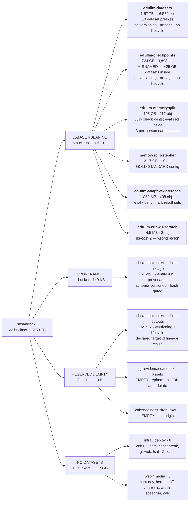

# S3 Dataset Audit — `sbsandbox` (<ACCOUNT_ID>)

**Date:** 2026-07-28 · **Access:** read-only via `sb-aws` MCP broker · **Scope:** all 23 buckets, datasets only

## Headline

**~1.63 TB of datasets are spread across 6 buckets. Only one of them is named `edullm-datasets`.**

The other five are a checkpoints bucket, a shared per-person scratch bucket, a frozen-corpus bucket, an
eval-results bucket, and a personal scratch bucket in the wrong region. There is no index, no shared
layout, and no way for an agent to discover a dataset without listing every bucket in the account.

| Class | Buckets | Bytes | Notes |
|---|---|---|---|
| Dataset-bearing | 6 | ~1.63 TB | ~64% of all account bytes |
| Provenance metadata | 1 | 140 KB | `…-lineage` — the best convention in the account |
| Reserved / empty | 3 | 0 B | incl. the best-governed bucket, never written to |
| No datasets | 13 | ~1.7 GB | infra, deploy, web, media — correctly excluded |

## Account map

## What each dataset-bearing bucket contains

```mermaid
flowchart TB
  subgraph B1["edullm-datasets · 1.57 TB · 16,539 obj · us-east-1"]
    direction TB
    A1["olmo-150b-dolma2/<br/>633 GB · 13,840 obj · 155.6B tok<br/>part-NNN-00000.npy + .csv.gz sidecar<br/>6,915 tiny sidecars · NO checksums"]
    A2["olmo100b/olmo-mix-1124-30b/<br/>532 GB · 1,172 obj<br/>NNNNN__domain__src__hash10.npy<br/>12-level vendored DCLM tree"]
    A3["olmo30b/olmo-mix-1124-30b/<br/>183 GB · 660 obj<br/>same inner name as olmo100b/"]
    A4["mythos-rdt/<br/>65 GB · 352 obj · cosmo2 uint16<br/>shard_NNNNN.bin AND sha256.uint16<br/>+ .pt ckpts + code tarballs"]
    A5["regmix/regmix-10b/<br/>53 GB · 27 obj · 10B tok<br/>one .json.gz per domain, unsharded"]
    A6["datamix1-jul22/<br/>38.5 GB · 96 obj · 9.28B tok<br/>CAS objects/sha256.npy + views/<br/>ONLY bucket w/ object metadata"]
    A7["curriculum-p1-jul23/<br/>37.5 GB · 286 obj<br/>part-NNNNN-of-NNNNN-sha256.u32le.bin<br/>BEST ENGINEERED · 176 obj staging debris"]
    A8["refhq/refhq-regmix-5p5b-v1/<br/>28.9 GB · 94 obj · 5.5B tok<br/>documents-NNNNN.json.gz · no README"]
    A9["p1hypothesis/…/20260724T050530Z/<br/>213 MB · 7 obj · .tar.zst parts"]
    A10["_manifests/ · tmp/ · _scratch/<br/>orphaned manifest, .py source, .sh"]
  end

  subgraph B2["edullm-checkpoints · 724 GB · MISNAMED"]
    direction TB
    C1["token-selection/_scratch/refhq370m/tokenized/<br/>~22 GB · 7 domains · domain.npy<br/>NO NumPy header — raw uint32<br/>best sidecar metadata in account"]
    C2["…/lean-split/staging/stp/STP_Lean*/<br/>2.9 GB · train-NNNNN-of-NNNNN.parquet<br/>ONLY canonical HF sharding · train only"]
    C3["olmo-370m/olmo400m-championship/…/data/<br/>25 .jsonl synthetic math<br/>signed: artifact_id + signature<br/>manifest.json w/ rows+sha256+per_skill"]
  end

  subgraph B3["edullm-memorysplit · 195 GB · 3 namespaces"]
    direction TB
    E1["stephen/runs/1b-v3/eval-holdout/<br/>14 tasks × 512 items · items.jsonl<br/>contract_id + acceptance_rule<br/>split by index range >= 1e9"]
    E2["adarsh/runs/*/evals/<br/>Wikidata multi-hop · meta.split field"]
    E3["sid/runs/eval/ + eval_now/<br/>same domain, 3rd schema"]
    E4["stephen/corpus/sha256/<br/>29.5 GB DUPLICATE of B4"]
  end

  subgraph B4["memorysplit-stephen · 31.7 GB · GOLD STANDARD"]
    direction TB
    F1["corpus/&lt;sha256&gt;/base + extension/<br/>packed/targets.bin · sidecars/*.bin<br/>receipt.json: merkle_root + stream hashes<br/>locks/FROZEN.json: contract_id + scope"]
    F2["KMS + BucketKey · Versioning ON<br/>Object Lock GOVERNANCE 30d<br/>Tagged: Project/Owner/Purpose/ManifestSha"]
  end

  subgraph B5["edullm-adaptive-inference · 869 MB"]
    direction TB
    G1["backfill-mcq/mcq/&lt;task&gt;/org__model.csv<br/>92 files · 12 are 66-byte header-only"]
    G2["tutorbench-responses/ + -v2/<br/>97 vs 92 files · NEITHER is superset"]
    G3["edu-judge-validation/v2/ + v3-evidence-gated/<br/>.jsonl + .manifest.json sidecar<br/>BEST run provenance: frozen_configuration_hash"]
    G4["edu-tutor-grading/…/canonical_r1.jsonl<br/>274 MB single unsharded file"]
  end

  subgraph B6["edullm-ericwu-scratch · 4.5 MB · us-east-2"]
    direction TB
    H1["olmo400m-championship/retention_general_text.jsonl<br/>single key: text · no id/source/license<br/>3rd byte-identical copy in account"]
  end
```

## The formatting problems, ranked

### 1. `.npy` is a lie on 7,557 objects

`datamix1-jul22/README.md` says it outright: *"headerless little-endian uint32 memmaps; the `.npy`
suffix does not imply a NumPy header."* Same in `edullm-checkpoints/token-selection/_scratch/…`,
verified arithmetically — `wiki` reports `stream_tokens_with_eos` 86,096,509 × 4 bytes = 344,386,036 =
the exact object size, with byte 0 being token data rather than `\x93NUMPY`.

`np.load()` fails on every one of them. `np.memmap(dtype=np.uint32)` is required. Meanwhile
`curriculum-p1-jul23` names the identical physical format honestly as `.u32le.bin`, and `mythos-rdt`
calls it `.bin` / `.uint16`. Three names, one format, and the most-used name is wrong.

### 2. Six incompatible shard-naming schemes for one logical thing

| Scheme | Where | Missing shard detectable? |
|---|---|---|
| `part-00000-of-00070-<sha256>.u32le.bin` | `curriculum-p1-jul23` | Yes |
| `train-00000-of-00007.parquet` | `edullm-checkpoints` STP_Lean | Yes |
| `part-000-00000.npy` / `part-00-00000.npy` | `olmo-150b-dolma2` | No — and padding varies *within* one dataset |
| `<sha256>.npy` | `datamix1-jul22` | No — order only in manifest |
| `<sha256>.uint16` | `mythos-rdt/farmshare_40b` | No |
| `shard_00000.bin` | `mythos-rdt/shards` | No |
| `NNNNN__<domain>__<src>__<hash10>.npy` | `olmo30b`, `olmo100b` | No |

Only two of seven let you spot a missing shard from a listing. This matters concretely: the training
stack reads via glob (`part-*.npy`, `shard*.npy` in `npy_instance_source`), so naming is not cosmetic.

### 3. ~67 GB of known byte-identical duplication

- **~37 GB** — `datamix1-jul22/packed/objects/<sha>.npy` and
  `curriculum-p1-jul23/releases/…/tokens/objects/part-NNNNN-of-00070-<sha>.u32le.bin` are the same
  objects (identical ETag `993518b1…-64`, identical 536,870,912 B, identical `x-amz-meta-sha256`).
  Both prefixes total exactly 70 objects / 37,126,258,688 B. One dataset re-materialized the other's
  CAS instead of referencing it.
- **~29.5 GB** — the frozen corpus exists in both `memorysplit-stephen/corpus/<sha>/` and
  `edullm-memorysplit/stephen/corpus/<sha>/`. Same key suffixes and sizes, **different ETags** — so
  re-uploaded, not server-side copied. The governed copy has KMS + versioning + Object Lock + tags;
  the other has none. Nothing marks which is authoritative.
- **3 copies** of `retention_general_text.jsonl` (ETag `8eaa921b…`), one of them in us-east-2.

### 4. Manifests point at machines that no longer exist

Every dataset that has good metadata keys it on **absolute local paths** instead of S3 URIs:

- 6,915 `.csv.gz` sidecars in `olmo-150b-dolma2` → `/mnt/raid0/dolma2-samples/…` (decommissioned)
- `refhq/…/final_manifest.json`, `regmix/…/wiki.json`, `olmo100b/…/tokenized/shards/*.json` → `/scratch/users/<user>/…`
- `edullm-checkpoints/…/experiment/data/manifest.json` → `/mnt/nvme/…`
- `edullm-memorysplit/…/items_manifest.json` → local paths

None resolve from S3. The metadata is high-quality and unusable.

### 5. Dangling pointers everywhere

| Pointer | Target | Status |
|---|---|---|
| `curriculum-p1-jul23/…/release.json` | `loader/`, `_SUCCESS`, `validation/` | all absent |
| `regmix/regmix-10b/README.md` | `plan/summary_final.json` | actual file is `plan/summary.json` |
| `refhq/…/final_manifest.json` | `s3_bucket: edullm-dataset-refhq` | wrong bucket — lives in `edullm-datasets` |
| `regmix/…/README.md` | `s3://edullm-dataset-olmohq/…` | bucket does not exist |
| lineage `intent/run_019fa446…` | `s3://sbsandbox-intern-edullm-checkpoints/` | bucket 404s |
| `edu-tutor-grading/…/judge_inputs_manifest.json` | `tutorbench-responses/_response_manifest.json` | key does not exist |
| `memorysplit-stephen/…/receipt.json` | `corpus-build/` prefix | prefix absent |
| `edullm-memorysplit/stephen/inventory.json` | declares a bucket with 98 obj / 172 GB | that bucket holds 10 obj / 31.7 GB — describes the wrong bucket |

Committed code also still targets `edullm-dataset-datamix1-jul22` and
`edullm-dataset-curriculum-p1-jul23`, which no longer exist as buckets — someone correctly migrated
bucket-per-dataset → prefix-per-dataset, but the references and the date suffixes both survived.

### 6. Bad data is indistinguishable from good data by listing

- 12 CSVs of exactly 66 bytes — header only, zero rows —
  `backfill-mcq/mcq/{arc_challenge,arc_easy,openbookqa,sciq}/{internlm__internlm2_5-7b,tiiuae__falcon-7b,tiiuae__falcon-7b-instruct}.csv`
- `tutorbench-responses-v2/cerebras_Cerebras-GPT-*.jsonl` — three files, byte-identical 713,636 B,
  containing only `Finish Reason: "error"` records. `judge_inputs_manifest.json` confirms 1,161
  `auto_fail_cells`, all `empty_output`, and only `n_usable_models: 82` of 92 present.
- `edu-judge-validation/v2/blinded/gemma/canonical_r1/` has a `.manifest.json` and **no `.jsonl`**
- Two zero-byte objects in `curriculum-p1-jul23/staging/smoke/20260723T081607Z/`

A row/token count in a manifest plus a commit sentinel catches all of this. Neither is enforced.

### 7. Five success-sentinel conventions, and no `_SUCCESS` in S3

`_SMOKE_SUCCESS` (curriculum smoke) · `.done` companions (212, vendored DCLM) · `_metadata`
(curriculum annotations) · `COMPLETE.json` (checkpoints) · `_SUCCESS.json` (local only). Meanwhile
`release.json` declares `"success": "_SUCCESS"` — and no `_SUCCESS` object exists anywhere in S3.

### 8. Naming and governance

Four top-level naming styles coexist in `edullm-datasets`: kebab+date (`curriculum-p1-jul23/`,
`datamix1-jul22/`), kebab (`mythos-rdt/`), squashed (`olmo100b/`, `refhq/`), underscore
(`_manifests/`). Four date formats: `-jul22`, `20260724T050530Z`, upstream codes `dolma2-0625`, and
none. `datamix1-jul22/` objects are all dated 2026-07-28 — the prefix name lies about vintage.
`olmo100b/` contains a **30b** mix. `olmo30b/olmo-mix-1124-30b/` and `olmo100b/olmo-mix-1124-30b/`
have identical inner names.

Governance, dataset buckets only:

| Bucket | Versioning | Encryption | Tags | Lifecycle | Object Lock |
|---|---|---|---|---|---|
| `memorysplit-stephen` | Enabled | **KMS + BucketKey** | 4 tags | none | GOVERNANCE 30d |
| `edullm-datasets` | **none** | SSE-S3 | **none** | **none** | no |
| `edullm-checkpoints` | **none** | SSE-S3 | **none** | **none** | no |
| `edullm-memorysplit` | **none** | SSE-S3 | **none** | **none** | no |
| `edullm-adaptive-inference` | **none** | SSE-S3 | **none** | **none** | no |
| `edullm-ericwu-scratch` | **none** | SSE-S3 | 1 tag | **none** | no |

1.57 TB of unversioned research data with mutable aliases in it (`mythos-rdt/code/latest.tar.gz`,
`ckpt/best.pt`, `ckpt/latest.json`) — any overwrite is unrecoverable. And `memorysplit-stephen`'s
Object Lock expires **2026-08-24**, after which immutability silently lapses on a bucket tagged
`Purpose=FrozenCorpus`.

## What is already right — keep all of this

Ranked by how much of the standard it can supply:

1. **`release.json` as a typed root pointer** (`curriculum-p1-jul23`) — `release_id`,
   `schema_version: "edullm-curriculum/v1"`, and explicit pointers to every sub-component. One GET to
   understand a dataset.
2. **Explicit binary-format declaration** — `storage{byte_order, container, dtype, header_bytes}`.
   This is the correct answer to the `.npy` problem.
3. **The lineage state machine** (`…-lineage`) — entity-per-prefix `intent/ → decision/ → binding/ →
   attempt/ → events/ → result/`, `schema_version` on every record, UUIDv7 typed IDs, and
   `manifest_sha256` approval-gating that **demonstrably fired** (two runs rejected:
   `manifest_hash_mismatch`, `no_execution_target`).
4. **Full tokenizer pinning** — `tokenizer{repo_id, revision, fingerprint_sha256, vocab_size,
   embedding_size, eos_token_id, pad_token_id}` + `provenance/tokenizer.lock.json`.
5. **Upstream pinned to immutable commits** — `datamix1-jul22`'s `inventory[]` records
   `repo_id` + `revision` + `size` per source shard, plus `x-amz-meta-hf-revision` on objects.
6. **CAS + views separation** — `packed/objects/<sha256>.npy` + `views/<name>/manifest.json` lets many
   curricula share one token population without copying bytes. (Then a second dataset copied the bytes
   anyway — the pattern is right, the discipline wasn't.)
7. **`X-of-N` shard names with embedded content hash** — `part-00000-of-00070-<sha256>.parquet`.
8. **Arrow-typed schema files** — `annotations/static-v1/schema.json` with exact widths and
   `schema_version` + `annotation_config_id`.
9. **Per-shard sidecars** recording `docs`, `tokens`, `bytes`, `tokenizer`, `eos_token_id`.
10. **`staging/` vs `releases/` separation** — right instinct for promotion gates.
11. **`audits/` as first-class** — `leakage-summary.json`, `release-determinism-attestation.json`,
    `decontamination-bundle-manifest.json`.
12. **Immutable conditional writes** — `put_object(IfNoneMatch="*", ChecksumSHA256=…)` raising
    `ConditionalConflict`, in `pipelines/week1_curriculum/src/week1_curriculum/s3io.py`.
13. **`_SUCCESS` written last**, containing `{"manifest_sha256"}`, with the uploader refusing if it
    appears before the full object set — `pipelines/week1_datadecide/src/week1_datadecide/s3_upload.py`.
14. **`contract_id` + `schema_version` + `format` triple** in receipts — 30 distinct `schema_version`
    values already in use across the local pipelines.
15. **`memorysplit-stephen`'s whole bucket posture** — content-addressed root prefix echoed into a
    bucket tag, KMS + BucketKey, versioning, Object Lock, four meaningful tags.

The house style already exists and is converging. It is applied to **1 bucket of 23**.

## Out-of-scope findings worth acting on

Not datasets, but surfaced during the sweep:

1. **`sina-reels-media-<ACCOUNT_ID>` is world-readable** — all four Public Access Block flags `false`
   plus an anonymous `s3:GetObject` on `/*`. The 17 marketing reels are public by design; the risk is
   that the wildcard grant with no PAB guardrails makes *anything* later written there instantly
   public. `austin-speedrun-site` has the same shape at lower severity (intentional static site).
2. **`s3://hermes-sffs-media/posthog-dw/email_signups/email_signups.jsonl` holds live PII** — email,
   referrer, user-agent — in an unversioned, lifecycle-less media bucket. Correctly private, so not an
   exposure, but personal data with no retention rule beside publishable marketing video. Should move
   to its own bucket with an explicit lifecycle.
3. **`gt-evidence-sandbox-assets` is configured correctly for a curated corpus** (versioning +
   noncurrent-expiry + fully tagged) but is `Environment=ephemeral` with
   `aws-cdk:auto-delete-objects=true` — it will be emptied when its stack is destroyed. Good config,
   wrong durability class. **CDK auto-delete buckets are never a dataset home.**
4. **No lifecycle policy on any bucket in the account except two.** `lsatspeedrun-sandbox-artifacts`
   is 14× its sibling purely from unpruned Lambda deploys; `mcat-dev` has 1,954 log objects averaging
   1.3 KB with no expiry.

## Method

Read-only via the `sb-aws` MCP broker against `sbsandbox`: `list-objects-v2`, `list-object-versions`,
`head-object`, `get-bucket-*`, `get-object-tagging`, `get-public-access-block`, `get-bucket-policy`,
and `get-object` restricted to `--range bytes=0-2047` on text files only. No media bodies fetched. No
mutations. Five parallel agents; every bucket fully enumerated except four large prefixes in
`edullm-datasets` (`packed/objects/`, `mythos-rdt/*/shards/`, `olmo100b/…/tokenized/shards/`, and the
6,144-object `all-dressed-snazzy2/`), which were sampled for naming patterns and server-side
aggregated for counts and sizes. Object counts and byte totals are exact.

No PII, credentials, or student data observed in any peeked dataset content — corpus text was public
Wikipedia/academic material and synthetic tutoring or math problems. `audit-logs/` and
`web-access-logs/` under `mcat-dev` were deliberately **not** read, as they plausibly contain
requester IPs and learner request paths. The one PII file found (finding 2 above) was characterized by
shape only. Temp peek files deleted.
